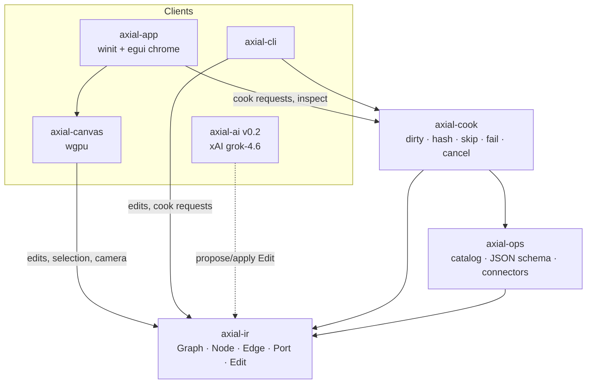
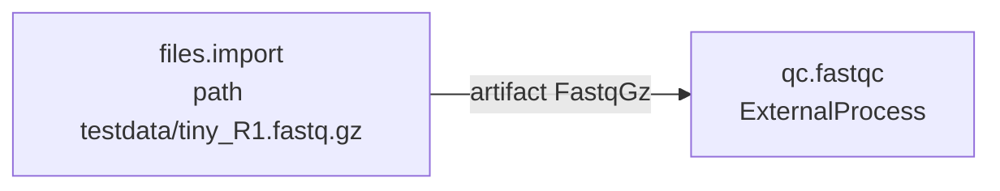
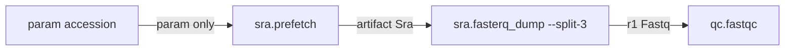

# Axial — Design Document

| Field | Value |
|---|---|
| **Title** | Axial: a local-first node graph for bioinformatics pipelines |
| **Author** | Jake |
| **Date** | 2026-08-24 |
| **Status** | Approved (open questions resolved) |
| **Product name** | **Axial** (CLI `axial`, crates `axial-*`, graphs `*.axial.json`). Former working name: Operon. Git folder: `bio_touch_designer`. Trademark: **unchecked**. |
| **License** | Apache-2.0 |
| **v0.1-cli** | IR + cook + CAS staging + CLI: fixture FASTQ → FastQC PNG artifact; optional live SRA. Same `cook()`. |
| **v0.1-canvas** | Infinite canvas, node anatomy, Preview blit, Cook button. 2k/60 is a bench report, not a merge gate. |

---

## Overview

**Axial is TouchDesigner's cook model, Flora's canvas HCI, and HoX's "don't haul files / typed substrate" — as an open, local-first graph IR. It is not a Galaxy clone, not a Nextflow GUI, not a generative-media SaaS, and not a biology appliance.**

Bioinformatics already has workflow *languages* (Nextflow, Snakemake, CWL, WDL) and one successful web workbench (Galaxy). It does not have a local instrument: an infinite node-edge canvas a computational biologist actually lives in, where looking at a cheap node pulls a cook, expensive steps show honest progress, artifacts are typed and cached by hash, previews live *on* the node, and the graph file is the source of truth — including for AI, headless HPC, and reusable compounds.

A Rust graph IR is the deepest module. A native wgpu canvas, a local cook engine, CLI wrappers of NCBI/SRA/Ensembl/nf-core, and an xAI client are all *clients of the IR*. The GUI never has a private execution path. Python never touches the canvas, the graph, or the executor.

v0.1 is not a platform. Two tags, one codepath:

- **v0.1-cli:** `axial cook` a graph that runs FastQC on a shipped `<1 MB` Illumina FASTQ fixture, writes a `Preview` PNG into CAS, skips on the second cook. Optional live SRA (`AXIAL_LIVE_SRA=1`) is not the CI default.
- **v0.1-canvas:** the same graph on an infinite canvas; FastQC PNG on the node body; Cook button; pan/zoom. If the CLI loop is not faster than a shell script, the product has failed. The canvas is the product surface, not chrome around a CLI — it ships as a second tag, not as the first mergeable demo.

---

## Background & Motivation

### Why this exists

The daily loop for a lot of genomics is still: `prefetch` / `datasets download` / `nextflow run nf-core/…` / stare at a MultiQC HTML in Firefox / edit a params YAML / re-run and pray `-resume` hits. The graph of what you *meant* lives in your head, a Nextflow script, a Galaxy history, and a Slack message.

Three products already solved pieces of this in other domains. We steal from them. We do not clone them. Bioinformatics payloads are HoX-shaped (don't haul files); the canvas should feel like Flora (spatial, visual, exploratory); the cook engine should feel like TouchDesigner (pull, dirty, honest).

### Why visual bioinformatics mostly lost to text

This is not a secret and it is not "users prefer code." Specific failures:

| System | What it got right | Why it did not displace Nextflow/Snakemake |
|---|---|---|
| **Galaxy** (MIT; Python web; NAR 2026 update) | No-code tools, histories, huge tool shed, teaching, IWC workflows, public servers | Server-centric: you upload into *Galaxy's* disk, not your scratch. Workflow editor is a separate mode from running (form-based tools, cluster-queued jobs). Kitchen-sink discovery (thousands of tools) is worse than a small catalog. Web DOM canvas does not feel like an instrument. Among Nextflow users, Galaxy usage fell 17% → 5% (2021–2024); Nextflow took ~43% of WfMS citations in 2024 while Galaxy's absolute citations flattened after 2021 ([*Empowering bioinformatics communities with Nextflow and nf-core*](https://pmc.ncbi.nlm.nih.gov/articles/PMC12309086/)). Galaxy remains the right answer for hosted teaching and no-code on a public server. It is the wrong architecture for a local-first daily driver. |
| **Nextflow + nf-core** (Apache-2.0) | Dataflow DSL, executors for local/SLURM/cloud, `-resume` via task hash + `work/` dir, 90+ curated pipelines, JSON Schema params (`nextflow_schema.json`) | Won production. Lost the *canvas*. Seqera Platform launches pipelines from schema forms; it does not make the DAG the thing you edit. Groovy DSL2 is a real learning cliff. Resume hashing includes container ID, command string, inputs — correct, and opaque when it misses. |
| **Snakemake** | Python-native, make-like, good on HPC, DAG *visualization* | Visualization is a report, not an editor. File-target mental model fights "this accession becomes these FASTQs." |
| **CWL / WDL** | Portable descriptions; Cromwell/miniwdl/Toil execute | The text *is* the source of truth. Visual tools (Rabix Composer, CWL-SVG, WDL IDE/LSP) are converters and linters. Cromwell dropped CWL (v80+). Nobody lives in the graph. |
| **KNIME** | Serious node canvas, typed tables, cheminformatics | Java, table-centric. BAM/FASTQ are files on disk, not KNIME tables. Crowded enterprise workflows. Not git-native genomics. |
| **Chipster** | Easy tool wrappers, recorded workflows | Client-server Java. Workflow is a recording of clicks, not an IR. Did not survive NGS scale as a community standard. |
| **Orange** | Teaching canvas, add-ons including bioinformatics | In-memory Python. Review pattern: memory and scale. Not an NGS workbench. |
| **Taverna / Kepler** | Academic visual WFMS | SOAP/WSDL-era. Dead as a daily driver. |
| **Latch / Form Bio / DNAnexus / Terra** | Cloud UX, sometimes visual | Data gravity in *their* bucket. Fine as a hosted product. Not an open local instrument. |
| **Seqera AI / "agentic genomics"** | LLMs writing Nextflow | AI around the DSL, not a graph IR the model can diff. Agents that SSH into clusters are a threat model, not a v1 feature. |

Houdini (SOP/COP) and Notch are additional node-model priors. All cook. The three we treat as first-class product inspirations are Derivative, Flora, and HoX.

### Inspirations (Flora / Derivative / HoX)

Verified 2026-08-24. Steal the mechanism. Reject the product.

#### Derivative / TouchDesigner

[derivative.ca](https://derivative.ca/) · [docs.derivative.ca](https://docs.derivative.ca/) · cook: [UserGuide/Cook](https://docs.derivative.ca/UserGuide/Cook)

TD is an instrument. The `.toe` / network *is* the file. Operators come in typed families (TOP / CHOP / DAT / SOP). Cooking is a **pull** system: a common misconception is that changing an upstream node pushes a cook downstream. It does not. A node cooks only if (1) something requested it — a visible viewer, a displayed panel, an output device, cook-to-here — **and** (2) it has a reason — dirty inputs/params, never cooked, or time-dependent. Dashed wires mean *upstream is cooking*, not that downstream has finished. Probe/Perform expose `cook_time`, skip vs recook, on the node.

| Steal | Reject |
|---|---|
| Pull cook: request ∧ reason. Viewers and outputs pull. | 60 Hz time-sliced CHOPs. Genomics is not a frame clock. **No time-dependent cooks.** |
| Looking at a node is a cook request (viewer). | GPU TOPs as the payload. Sequence data is not a texture. |
| Dirty flags, cook state on the node, `cook_time` / skip vs recook as observability. | Python-in-the-node. |
| The graph file is the file. | Particles / animated geometry on a BAM. |
| Typed operator worlds. Our analogue: typed ports + a *small* catalog. | TD's family soup (TOP/CHOP/DAT/SOP/MAT/COMP). We do not clone the taxonomy. |

**HCI implication:** cheap nodes (preview extract, metadata) pull when their viewer is on. High-cost nodes (prefetch, fasterq-dump, FastQC on a real FASTQ, `nextflow run`) show Dirty and wait for an explicit Cook. Opening a 40 GB node must not start a download.

#### Flora

[flora.ai](https://flora.ai/) · canvas: [flora.ai/product-canvas](https://flora.ai/product-canvas) · [docs.flora.ai/editor/canvas.md](https://docs.flora.ai/editor/canvas.md) · techniques: [docs.flora.ai/nodes/techniques](https://docs.flora.ai/nodes/techniques) · manifesto: [flora.ai/blog/manifesto](https://flora.ai/blog/manifesto)

Flora is a Figma-like infinite canvas for generative media (text/image/video/audio). Double-click spawns a node; drag `+` handles to wire; you can wire nodes that are still processing (readiness is checked at generation time, not connection time). Previews live *on* the node — the image *is* the node. **Techniques** package a multi-step workflow as one node with defined I/O; **Detach** expands internals onto the canvas (one-way); Technique Builder publishes a subgraph; **App Mode** is a form over a technique with no canvas. **Elements** are reusable locked references. **Batch** is one setup × N variations. Founder Weber Wong (NYU ITP / applied HCI): AI tools should not be one-shot slop — "control of the process, see the different steps play out, then iterate in different directions." Manifesto: ease *and* control, flow state, power tool for professionals. Claim: 17M nodes created, "canvas that will never slow you down." AI is *on the canvas*, not a chatbot sidecar.

| Steal | Reject |
|---|---|
| Infinite canvas as the product surface. Not Galaxy's "workflow editor is a separate mode." | Cloud SaaS. Local-first is non-negotiable. |
| Node-as-preview: bounded PNG/table/log *on the node body*. | Generative media payload, 50–60+ model marketplace, fashion studio. |
| Techniques as *compound operators* (subgraph with published ports). A `.axial.json` *is* a technique. Detach = inline the child DAG. | Technique marketplace in v0.1. No community recipe store. |
| App Mode is an **analogy** for headless CLI (form/CLI over a technique, no canvas) — not identity. Flora App Mode is a hosted form. | Untyped "connect anything." Our edges type-check. |
| AI mutates the graph in place. Branching a node to try an alternative is a first-class `Edit`. | Chatbot sidecar. One-shot slop. |
| Double-click spawn, wire-while-cooking, power-tool feel. | Web DOM canvas. |
| Canvas must not hitch on pan/zoom of a real graph. 2k/60 is a **bench we report**, not Flora's slogan as a merge gate. | Flora's batch node as v0.1 IR. Scatter is v1; published ports stay named. |
| Elements → a pinned Artifact/Value (identity by hash), not a fashion model. | |

**HCI implication:** the canvas should feel like Flora. The cook engine should not. Bioinformatics files are HoX-shaped.

#### HoX

[hox.bio](https://hox.bio/) · [What is HoX](https://hox.bio/blog/what-is-hox) (James van Alstine, 2026-08-06) · [genomics viewer](https://hox.bio/blog/genomics-viewer) · [warehouse / control plane](https://hox.bio/warehouse)

HoX is a closed "Biology Computer": samples → warehouse → apps. Vertically integrated bio-OS. National-security / clinical deployments, appliances in a box, federated Biological Information Network. **Integration is a property of the data model, not glue after the fact.** Resource graph: patient → samples → libraries → reads, domain semantics over a columnar warehouse + blob store. Apps compose without downloads (click a gene in scRNA → genomic viewer, no file shuffle). Fast viewer: WebGL, stream-on-demand, do not transfer the BAM to the browser. Control plane: browser, CLI, API — same data, same permissions; agents talk to the system of record from the terminal. Motto: send queries, don't ship all data / don't push metadata-only. Pipelines "built in" — not the differentiator we copy.

| Steal | Reject (hard non-goals) |
|---|---|
| Typed artifacts + provenance as the integration layer. Accession → sra → fastq → qc is a **resource graph**, not a pile of paths. | Sequencing hardware, robotics, lab logistics. |
| Never haul a BAM/FASTQ into the UI process. Preview and range-view are cheap extracts. | Appliances, federated BIN, HQL, clinical patient graphs. |
| Same substrate for GUI, CLI, AI. HoX: control plane. Us: IR + project cache. | Closed warehouse, multi-tenant cloud, DoW/biosecurity product. |
| Viewer is a *module over artifacts*, not the canvas. v1 IGV-range / genome view is a cook output or a sidecar process — never inlined sequence into wgpu node quads. | Becoming "HoX but open source." Different product. |
| Provenance records in the cache: who produced this hash, from which node/run, from which parent artifacts. | Patient/sample/library ontology. We stop at artifacts. |
| "Send queries, don't ship the file." | |

We are the **open local instrument**, not their appliance. Computational biologists building graphs on laptops and HPC scratch. No claim on clinical systems of record.

### The contradiction, resolved

An "extremely performant canvas" cannot be a Python UI. Galaxy is the existence proof: Python + web forms + a DOM graph editor. Axial is **Rust for the IR, the cook engine, the cache, the process supervisor, and the canvas**. Python is not in the process. A user who wants to wrap a CLI writes a JSON operator schema; if the tool itself is a Python script, Axial execs it as a subprocess, same as `prefetch`.

---

## Goals & Non-Goals

### Goals (v0.1-cli) — PRs 1–9 + staging; mergeable without a window

1. **Graph IR** as the only source of truth: JSON on disk, git-diffable, round-trippable, no GUI-only execution state.
2. **Headless CLI** cooks the IR (`axial cook`). Flora App Mode is an analogy, not identity.
3. **Typed ports** with compatible-edge checking. Not "file path" soup.
4. **Content-addressed cache** with named staging into work dirs, provenance resource graph, and persistable last cook keys under `.axial/`.
5. **Compound IR:** `GraphRef` + published ports. One shipped compound graph. Zero user-authored techniques required. `InlineCompound` enum exists; `apply` is in `axial-ir` with `CompoundLoader` (no filesystem in that crate). Detach UI is v1.
6. **CLI operator schema** so a user can wrap a binary without touching Rust.
7. **Wedge:** `files.import` of shipped `<1 MB` Illumina-like R1 FASTQ fixture → FastQC → `Preview` PNG in CAS; second cook skips. Optional live SRA is not CI.
8. **IR shaped for AI:** discrete `Edit`s including `DuplicateNode` / `Branch`. No chatbot. v0.2 is **prompt-to-graph** (chrome prompt, not an IR node).

### Goals (v0.1-canvas) — PRs 10+; second tag

1. **Native wgpu infinite canvas.** Nodes are not DOM, not egui windows. Pan/zoom at instrument feel on a real wedge graph.
2. **Flora-level gestures:** double-click spawn, drag-port-to-port wire, cook chrome, wire-while-cooking. Not Technique Builder UI.
3. **Node-as-preview:** blit the FastQC `Preview` artifact onto the node body (renderer downscales; artifact bytes unchanged).
4. **Pull cook in the GUI:** Cook / Cook-to-here; `cost: high` never viewer-pulled.

`axial bench canvas` **reports** FPS at 2k nodes. It is not a merge blocker for v0.1-canvas.

### Goals (v0.2 / v1 — named so they do not leak into the wedge)

- **v0.2:** AI-on-canvas client (`grok-4.6`). **Prompt-to-graph:** one prompt may insert/rewire a subgraph. User accepts the `Edit` list (max 32). Never auto-cooks. Prompt is canvas chrome, not an IR node. Ensembl / NCBI Datasets operators.
- **v1:** Technique Builder UI (select subgraph I/O, publish a compound). Detach/inline a compound onto the parent canvas. **Scatter/gather only after a written IR decision** (named ports stay; no arrays through `Directory`). Sidecar genome viewer module over artifacts (HoX-style: stream, don't haul).

### Non-goals (v0.1 and near v1)

- Kitchen-sink **we maintain**. Users wrap their own tools; we do not host or tastefully optimize a shed. Also not a HoX boutique of eight native modules.
- Technique marketplace, community recipe store, model marketplace.
- Flora SaaS: cloud canvas, fashion studio, generative-media payload, untyped connect-anything.
- HoX appliance: sequencing hardware, federated BIN, HQL, clinical patient graphs, closed warehouse, DoW/biosecurity product, multi-tenant cloud. **Not "HoX but open source."**
- HPC/cloud executors (SLURM, AWS Batch, Kubernetes). Later adapter at the cook seam.
- Scatter/gather, loops, conditionals in the IR (v0.1). Ports stay named; do not sneak arrays through `Directory`.
- CWL/WDL import/export.
- Multi-user, accounts, sharing servers.
- In-process BAM/VCF parsing into GPU buffers. Sequence never inlined into node quads.
- Embedded IGV as the canvas. Range snapshots are v1, as a *viewer module* or `Preview` cook, never the graph renderer.
- General bioinformatics Q&A chatbot. Agents that SSH to clusters or auto-write arbitrary Nextflow.
- Python runtime / Jupyter / plugin VM.
- A second (web) canvas. Wasm of *this* canvas is the v1 path.
- Realtime "data particles" on sequence files. 60 Hz time-dependent cooks.
- Undo stacks, collaborative editing, visual themes as a product surface. (Undo remains a non-goal for v0.1; canvas *feel* is not optional chrome.)
- MultiQC as a required wedge node (FastQC PNG on the node is enough).
- Ensembl / NCBI Datasets as required v0.1 connectors (JSON may exist; not the wedge).
- nf-core stub as a v0.1-cli acceptance item (later PR).
- Controlled-access SRA (NGC / dbGaP / `--ngc`). **v0.1 public accessions and local FASTQ only.**
- 2k-node / 60 FPS as a merge gate.

---

## Ubiquitous language

Definitions only. What the thing *is*.

| Term | Definition |
|---|---|
| **Graph** | The directed typed network the user edits. The source of truth on disk. Not called a pipeline, patch, or network in the IR. |
| **Project** | A directory that contains one or more graph files, a local cache, and project config. |
| **Session** | One OS process (GUI or CLI) attached to a project. |
| **Run** | One requested cook of a graph (or a node cone), with an ID, timestamps, and provenance. |
| **Operator** | A catalog entry: typed ports, params, cook kind, cache behavior. The tool. |
| **Node** | A placed instance of an operator in a graph, with its own param values and layout. |
| **Port** | A named, typed hole on an operator. Input ports receive; output ports emit. |
| **Edge** | An IR connection from one output port to one input port. Must type-check. |
| **Wire** | The canvas stroke that depicts an edge. Chrome, not IR. |
| **Param** | A configuration value on a node that is *not* wired. Scalars, enums, paths, flags. |
| **Input** | A port that is filled by an edge (or a default). Distinct from a param. |
| **Artifact** | A content-addressed file or directory in the cache. The payload of an artifact port after a successful cook. |
| **Value** | A small typed datum that flows on a value port (accession, int, JSON metadata). Not hashed as a file; included in the cook key. |
| **Preview** | A cheap, bounded cook output (`PortType` / artifact type `Preview`) meant for the node body: PNG, TSV head, log tail. Never the backing artifact loaded into the renderer. |
| **Viewer** | The fact of looking at a node. A cook *request* for that node (TouchDesigner). Does not itself contain data. |
| **Cook** | The engine's act of realizing a node's outputs from its inputs and params. Happens only if requested **and** there is a reason (dirty / never cooked). Not a frame clock. |
| **Dirty** | Derived view: current cook key has no verified index hit. Not stored in the graph file. Downstream of Dirty is Dirty. Dirty is not a cook. |
| **Cache hit / skip** | Current cook key hits the index and artifacts verify; the node does not re-run. Visible on the node (`cook_time` vs skip). |
| **Staging** | Copy or hardlink of a CAS artifact into `{work}/in/<port>/<basename>` so CLIs see real names. CAS stays hex. |
| **Attempt** | One spawn of an ExternalProcess. Work dir is unique per attempt. |
| **Compound** | A node whose cook is another graph with published ports. Nested DAG. The graph file *is* the reusable unit. |
| **Technique** | User-facing name for a reusable compound (Flora). v0.1 ships one built-in; Builder UI is v1. Not an IR type. |
| **Branch** | An `Edit` that duplicates a node (and optionally its downstream cone) so an alternative operator/params can be tried in parallel. |
| **Provenance** | Cache record: artifact id → producer node, cook key, parent artifact ids. Not a patient/sample ontology. |
| **Connector** | An operator whose job is to talk to a remote data source (NCBI, SRA, Ensembl). Same IR type as any operator. |
| **Catalog** | The set of operators the session can instantiate. Built-in + JSON drops + graph-as-compound files. |

Marketing may say "visual pipelines." The IR says **graph**. Nextflow's "pipeline" and TouchDesigner's "network" are both overloaded in this audience (PPI networks, nf-core pipeline names). One word.

---

## Key Decisions

1. **Product name is Axial.** One name in public and in code: CLI `axial`, crates `axial-ir` / `axial-cook` / `axial-ops` / `axial-cli` / `axial-canvas` / `axial-app` / `axial-ai`, graphs `*.axial.json`, cache `.axial/cache`, env `AXIAL_CACHE` / `AXIAL_LIVE_SRA`. Git folder remains `bio_touch_designer`. Former working name: Operon (metadata only). Trademark **unchecked** (not searched in this document). Split identity (product Axial, CLI operon) is a brand bug — do not.

2. **Rust engine + wgpu canvas + egui chrome. Python is subprocess-only.** The performant canvas cannot be Python. One GUI process: winit + wgpu. Graph is a custom renderer (instanced quads / SDF edges). Inspector, logs, param forms are egui on the same device. Headless builds omit wgpu. v0.1-cli does not require wgpu.

3. **One canvas. Native v0.1. Wasm is a compile target of the same crate, not a rewrite.** xyflow/DOM will not hit the frame targets. A React canvas plus a Rust backend is two canvases. Rejected.

4. **The graph IR is the deepest module.** Canvas, cook, connectors, CLI, and AI depend on it. It depends on nothing in this workspace except `serde` / `thiserror` / blake3 types we own.

5. **Native cook engine for the graph; nf-core/Nextflow is one operator family.** One dirty/cache codepath. Three cook *kinds* (`InProcess` | `ExternalProcess` | `Compound`), not three engines. HPC is a future adapter at the cook seam, not a v0.1 abstraction.

6. **v0.1 graphs are DAGs.** No cycles, no scatter/gather, no conditionals. A compound is a nested DAG, not a cycle. Fan-out is a v1 IR decision; published ports stay named so scatter can land later without a rewrite.

7. **Typed ports with an explicit compatibility table.** Untyped path graphs are Galaxy-with-worse-UX. Artifact ports, value ports, and `Preview` ports are distinct. HoX: integration is a property of the data model.

8. **Content-addressed cache in the project directory** (`.axial/cache`), not `$HOME`. `AXIAL_CACHE` overrides. CAS object names are blake3 hex. Artifact metadata stores `{basename, declared_type, size, hash}`. Each index record stores provenance: producer node + cook key + parent artifact ids.

9. **Named staging for ExternalProcess (Nextflow-style names, Nix-style CAS).** `{input.port}` in argv is **not** the CAS hex path. Before spawn, stage read-only hardlinks (else copies) to `{work}/in/<port>/<basename>`. Never mutate staged inputs. Do not make tools eat hex names.

10. **Work-dir lifecycle:** unique attempt dir `work/<full_key_hex>/<attempt>/`. Always `mkdir -p`. Success: ingest outputs to CAS, then delete the attempt dir. Fail/cancel: keep for `axial inspect`; next attempt is a new dir. `resume_workdir: true` only when the schema sets it (`sra.prefetch`). `-t` temp is a **sibling** of the output dir, never inside the output glob tree.

11. **Pull cook (TouchDesigner), not push.** We do **not** do time-dependent cooks. Request sources: CLI `--to`, Cook / Cook-to-here, a visible viewer on a `cost: low` node, or a requested downstream node. `cost: high` never auto-pulls from a viewer.

12. **Cook loop order:** compute `key` first. Hit → bind + `Cached`. Miss + requested → cook. Miss + not requested → `Dirty` chrome only. Dirty is derived (current key vs index), not a graph field. Last keys live in `.axial/` (gitignored). GraphRef cycles detected by identity set of child graph hashes, not only depth.

13. **Cook key includes the resolved operator schema and child graph bytes.** Canonical encoding of argv, globs, bin, port types, cost, plus params and input hashes. Compounds include blake3 of the child graph **excluding layout** (operators, params, edges, published I/O — not pretty JSON, not the path string). **Still do not hash the tool binary** (Decision 21).

14. **Infinite canvas HCI (Flora) × pull cook (TD) × typed CAS (HoX).** Three layers. Canvas does not recook at 60 Hz; cook does not layout; CAS does not render.

15. **Node-as-preview.** FastQC glob-binds a `Preview` PNG artifact (original bytes in CAS). Canvas decode is renderer-only: downscale to ≤512 on upload, never mutate the artifact. Missing/invalid PNG → cook-state fill, not Failed, unless the port is `required`. Compound preview = published `Preview` port.

16. **Compound / technique-shaped IR.** Catalog `kind: compound` + `graph` path is the only way to declare a compound operator. `GraphRef` is a path struct on the catalog entry, not a second field on every node. Technique Builder UI is v1. A graph file *is* a technique.

17. **Operator plugins are JSON + argv token lists, not Python.** Overlay: project > user > shipped. Unknown fields rejected. In-process ops are a Rust inventory in `axial-ops`, not JSON.

18. **v0.2 AI is prompt-to-graph, not a chatbot.** Default model `grok-4.6`. One prompt may insert/rewire a subgraph. User accepts the `Edit` list (max 32). Never auto-cooks. Prompt stays **chrome**, not an IR node. Flora steal: control of the process, iterate in different directions. Not param-fill-only (fill/explain/suggest/branch remain additional capabilities). v0.1 ships the `Edit` schema only.

19. **License Apache-2.0.**

20. **v0.1-cli wedge is fixture FASTQ → FastQC Preview in CAS.** Live SRA optional. nf-core / Ensembl / Datasets are not v0.1-cli acceptance.

21. **Do not hash operator binaries into the cook key.** Schema + child graph bytes, yes. Distro `prefetch` rebuild must not bust the SRA cache. Optional `tool_version` probe is session-cached, not in the key in v0.1.

22. **Viewer modules ≠ canvas.**

23. **Project cook lock.** One cook of a project at a time (GUI or CLI). `Cache` is `Arc<Mutex<...>>`. tokio runtime **off** the wgpu thread. v0.1 target is Linux (and macOS if it builds); Windows is not a v0.1 target (`setsid` process groups).

24. **Node/edge IDs** are `n_` / `e_` + 32 lowercase hex characters (16 bytes from `getrandom`). No `ulid` crate. Layout float noise is accepted git churn (sidecar rejected).

---

## Proposed Design

### Architecture



`axial-ai` is a v0.2 crate (dotted). v0.1-cli does not link wgpu or xAI.

The IR does not know about wgpu, tokio, or HTTP. Cook does not know about the canvas. Connectors are operators in the catalog, not a second object model.

**Depth:** `axial-ir` is deep — validate, type-check, dirty cone, serialize, apply edits, produce a JSON Schema for AI. The interface is small: `Graph`, `Edit`, `validate`, `apply`, `cone`, `serde`.

**Seams that exist because two things actually vary:**

| Seam | Adapters in v0.1 | Later adapter (not abstracted until it exists) |
|---|---|---|
| Cook kind (`kind` in JSON: `inprocess` \| `external` \| `compound`) | `InProcess`, `ExternalProcess`, `Compound` | HPC/cloud supervisor |
| Operator source | Built-in Rust, JSON files, graph-as-compound files | (none — no marketplace) |
| Preview extractor | PNG, TSV-head, log tail | IGV-range snapshot / genome viewer module |

Do not invent a `trait Executor` for one local process supervisor.

### Live dataflow vs batch genomics (pull cook)

TouchDesigner: a node cooks only if **requested** and it has a **reason**. Cooking does not push from upstream. Viewers and outputs pull.

```text
requested(n) iff
    n in CLI --to cone
    OR n is a Cook / Cook-to-here target
    OR n has a visible viewer AND operator.cost == low
    OR some requested downstream node needs n's outputs     # pull

# Dirty is derived after key computation, not a stored field.
# NOT time-dependent. We do not have a frame clock.

refresh_state(n):                    # GUI chrome; no spawn
    key = cook_key(n)
    if index.hit(key): bind; Cached
    else: Dirty                      # unbind stale outputs

cook_node(n):
    key = cook_key(n)                # ALWAYS first
    if index.hit(key): bind; Cached
    else if requested(n): spawn/cook
    else: Dirty chrome only          # no bind of new outputs
```

"See data flow through" means four honest signals, nothing else:

1. **Dirty chrome** is a derived view after computing the current cook key vs `.axial/cache/index`. Not stored in the graph. Walking the cone for hashes is I/O on metadata, not a cook.
2. **Cook state** on every node: `Idle | Dirty | Queued | Cooking | Cached | Failed | Cancelled`. Header shows skip vs recook and last `cook_time` (TouchDesigner Probe, stolen as observability). Wires may dash *only* while the upstream node is `Cooking`. This is not a particle system.
3. **Progress** of `ExternalProcess`: byte counts for downloads (`prefetch` output), last N lines of stderr, optional `%` if the tool prints it. Ring buffer, 1 MiB cap. Compounds show the current child node as the step.
4. **Previews on the node body:** the node's `preview` output as a GPU texture (FastQC `per_base_quality.png`, TSV head raster, log tail). **Never** mmap a BAM into the UI process. **Never** decode FASTQ onto the GPU.

`cost: high` (prefetch, fasterq-dump, FastQC on real FASTQs, `nextflow run`): a visible viewer does **not** start the cook. Header reads Dirty. User hits Cook. Looking at a node that is already Cached shows the preview without recooking.

`cost: low` (preview extract, tiny in-process ops, metadata): visible viewer is a request. This is the TD steal that is safe.

**Wire-while-cooking (Flora):** `AddEdge` is legal while the source is `Cooking` if types match. Downstream does not start until the source is `Done` or `Cached`. Readiness is a cook concern, not a connection concern.

Headless always requests the `--to` cone (or all sinks). Cost is informational. Same `cook()` function.

### Canvas stack

**v0.1: native only.** `winit` + `wgpu` + custom graph renderer + `egui` overlay.

The canvas is the product surface (Flora), not Galaxy's separate workflow-editor mode. Undo stacks and themes are v0.1 non-goals. **Gestures and preview-on-node ship in v0.1-canvas.** 60 FPS at 2k nodes is a bench we report, not a merge blocker.

#### Node anatomy

```text
┌──────────────────────────────────┐
│ ● Cached  qc.fastqc    1.8s skip │  header: state, name, cook_time / skip
├──────────────────────────────────┤
│                                  │
│     [ per_base_quality.png ]     │  body: Preview texture, capped
│                                  │
│  ○ fastq              preview ●  │  ports on the node, not a separate pane
│                       html    ●  │
└──────────────────────────────────┘
```

- **Header:** operator title, cook state color, last `cook_time` or `skip`. TouchDesigner Probe, as chrome, not a CHOP.
- **Body:** one `Preview` texture. Artifact is the original PNG in CAS. Renderer downscales on upload to ≤512 px (default 256) into an atlas **capped at 64 entries / 64 MiB**. Missing/invalid PNG = solid cook-state fill, not Failed (unless the port is `required`). Prefetch body is a size/accession badge, not the `.sra`. Compound body shows a preview **only** if the compound publishes a `Preview` port.
- **Ports:** typed circles. Drag `+` / port to port to wire. Double-click empty canvas → spawn (catalog popover).
- **Params:** egui inspector, selected node only. Params are not drawn on the node body (TD parameter dialog / Flora sidebar).
- **Compound nodes:** same anatomy; body may show the child's sink preview. Badge `compound`. No detach UI in v0.1.

Looking at a node (selected + body visible) **is a viewer**, hence a cook request subject to the pull rule above.

Rejected alternatives:

| Option | Why not |
|---|---|
| Python + vispy/qt | Contradicts the performance premise. |
| xyflow / React | DOM nodes. Galaxy already did this. Will not hold 2k nodes at 60 FPS. |
| egui-node-graph | Semantics-agnostic immediate-mode nodes; poorly matched to a retained IR; Blackjack-era, not a 10k-node renderer. |
| egui-snarl | One egui widget per node. Fine for 50 nodes. Wrong cost model for 2k. |
| iced_nodegraph | Closest GPU story (SDF, instancing, benches at 100/500/2000 nodes, MIT). Rejected as a *dependency*: it wants to own interaction and does not speak our IR. **Steal the approach** (SDF edges, instanced node quads, tile cull, no per-frame graph alloc). Do not steal the widget graph. Also: iced XOR egui; inspector forms are egui's job (Rerun pattern). |
| Two canvases (native + web) | Two bugs forever. Wasm of `axial-canvas` is the v1 web path (WebGPU, Chrome-class browsers; no WebGL fallback). |

Renderer sketch:

- Camera: infinite pan/zoom, no rotation. Graph space units = pixels at zoom 1.
- Spatial hash (256 px cells) for hit-test and CPU culling. GPU draws the culled set.
- Passes: grid SDF → instanced edge capsules → instanced rounded node quads (color = cook state) → preview texture blit (visible nodes with a `Preview` only) → instanced port circles → selection.
- Text: glyph atlas for **visible** node titles only (~100–300), not 2k labels offscreen.
- Preview textures: `image` crate (PNG decode) → downscale on upload → atlas. Default 256², max 512², **≤ 64 live entries**. LRU evicts offscreen. A 40 GB FASTQ never becomes a texture. Atlas budget ≤ 64 MiB, separate from instance-buffer budget.
- No per-frame `Vec` in the hot path: persistent instance buffers, rewrite dirty ranges.
- Hit testing on CPU via the hash. No GPU picking in v0.1.
- Gestures: double-click spawn, drag wire, box-select, delete, Cook-to-here on selected. Wire-while-cooking allowed.

Layout (`x`, `y`) lives on the node in the IR. Git will see layout churn; acceptable. A sidecar layout file is a second source of truth — rejected.

### Headless CLI

The GUI is a client. If the graph only runs in a GUI, HPC users bounce.

```
axial new
axial cook     path/to/graph.axial.json [--to NODE]
axial status   path/to/graph.axial.json
axial inspect  run RUN_ID
axial inspect  artifact ARTIFACT_ID
axial cache    gc | ls | verify
axial op       ls | show ID
axial validate graph.axial.json
axial edit     graph.axial.json < edits.json
axial bench    cook --skip-hot
axial bench    canvas            # v0.1-canvas; reports FPS, does not fail CI
```

- **`axial cook`:** loads IR, validates, cooks. `--to NODE` = that node plus ancestors (the pull cone). **No `--from` in v0.1.** Empty `--to` = all sink nodes (nodes with no outgoing edges). Writes `.axial/runs/<id>.json`. Exit 1 on any Failed in the cone; 0 if all Cached or Done.
- **`axial status`:** `refresh_state` over the graph; prints node id, operator, state, key prefix (16 hex), artifact basenames. No spawn.
- **`axial cache ls`:** index keys and output bindings.
- **`axial cache verify`:** full blake3 of every CAS object referenced by the index.
- **`axial cache gc`:** delete CAS objects not reachable from the index. Does not delete work-dir leftovers (`axial inspect` those first).
- **`axial inspect artifact`:** metadata + parent walk.
- **`axial inspect run`:** the run JSON plus stderr tails still on disk under kept fail/cancel work dirs.

Same `axial_cook::cook` the GUI calls. Project cook lock: a second `axial cook` in the same project **exits 2** (`project locked`). It does not wait.

### Typed ports

First-class **artifact** types (v0.1 — do not grow without a wedge need):

```text
Sra, Fastq, FastqGz, Fasta, FastaGz,
Bam, Bai, Vcf, VcfGz, Table, Json, Html, Image, Directory, Text,
Preview
```

**Value** types: `String, Int, Float, Bool, Accession, Json`. Accession is a value, never an artifact.

Compatibility (allow edge iff `compatible(src, dst)`):

- Equal types: yes.
- `FastqGz → Fastq`: no (do not silently gunzip). v0.1 FastQC input is `ArtifactUnion[Fastq, FastqGz]`.
- `Union` on an **input**: yes if any member matches. No union on outputs.
- `Directory` is not a wildcard for "the FASTQs inside."
- **Exception:** `nf.run` emits `Directory` as its only output. That is an explicit catalog exception, deferred typed unpack, not a sneak through `compatible()`.
- `Text` is not `Json`. `Preview` is not `Image`.
- No `Any`.

`PublishedPort` carries `PortType` and must match the child endpoint. Drift = `validate` error.

Type is stored on artifact metadata `{basename, declared_type, size, hash}`. Extension sniff is a fallback. Declared vs sniff mismatch = warning on the node, still bind; downstream may fail with a typed cook error (not a silent coerce).

v0.1 `sra.prefetch`: accession is a **param only**. Optional value-port wiring is a later schema version.

`Preview` is a globbed PNG (or similarly small file) produced by the operator. Canvas downscale is renderer-only. BAM does not flow into a preview port. A future `preview.igv_range` operator emits `Preview` as a v1 viewer module. Never inline sequence into node quads.

### Content-addressed cache

Layout (project-local):

```text
.axial/
  cache/
    cas/aa/bb/<blake3>              # file bytes; name is hex, NOT the basename
    cas/aa/bb/<blake3>.dir/         # directory tree; inner names preserved, sorted hash
    meta/<blake3>.json              # {basename, declared_type, size, hash}
    index/<full_key_hex>.json       # cook key → bindings + provenance
  work/<full_key_hex>/<attempt>/    # unique per spawn; full 64 hex chars, not a prefix
    in/<port>/<basename>            # staged inputs (hardlink or copy)
    out/                            # operator outputs (globbed from here unless schema says {work})
    tmp/                            # sibling of out/; fasterq-dump -t
    stderr.log                      # ring, 1 MiB cap
  lock                              # project cook lock (flock)
  node_keys.json                    # last computed key per NodeId (derived cache; gitignored)
  runs/<run_id>.json
  config.toml
```

**Artifact metadata** (required, next to CAS bytes):

```text
{ "basename": "sample_R1.fastq", "declared_type": "Fastq", "size": 1048576, "hash": "<64 hex>" }
```

`basename` is the name the producing glob matched (or the staged input's basename if the tool preserved it). CAS object names stay hex. Bioinformatics CLIs never see hex paths.

**Named staging (ExternalProcess only):**

1. `mkdir -p {work}/in/{port} {work}/out {work}/tmp`
2. For each input artifact: same-filesystem `link({cas}, {work}/in/{port}/{basename})`, else copy. Then `chmod a-w` on the staged file (directories: chmod files inside, not the dir if the tool must write beside — v0.1 only stages files).
3. Argv `{input.port}` substitutes `{work}/in/{port}/{basename}`, **never** the CAS path.
4. `{work}` substitutes the attempt dir. `{work}/out` and `{work}/tmp` are siblings. Do not put `-t` inside the output glob tree.
5. Operators must not write inputs.

In-process ops receive CAS paths internally; they do not need staging.

**Index record:**

```text
{
  key,                          # 64 hex
  schema_hash,                  # blake3 of resolved operator schema
  child_graph_hash,             # blake3 of child graph *without layout*, or null
  producer: { node_id, graph_hash, run_id },
  parents: [artifact_id...],
  outputs: { port: { artifact_id, basename, declared_type } },
  cooked_unix_ms, wall_ms, skipped: bool,
  attempt, work_kept: bool
}
```

**Cook key** (blake3 of a length-prefixed canonical encoding, not JSON pretty):

```text
operator_id
|| operator_version
|| schema_canonical     # argv tokens, output globs, bin, port types, cost, resume_workdir, success_exit_codes
|| canonical_params     # sorted keys; Int decimal; Bool 0/1; Float via OrderedF64 bits after NaN reject
|| input_artifact_ids[] # including types
|| input_values[]
|| child_graph_hash     # Compound only; see below
```

`schema_canonical` is the **resolved** catalog entry after overlay (project > user > shipped). Same `id`+`version` with different argv is a different key. Child nodes of a compound keep their own keys; the parent key additionally includes `child_graph_hash` so editing the child graph without bumping a version does not false-skip the compound's published bindings.

`child_graph_hash` is blake3 of the same length-prefixed encoder over the child graph **excluding layout**: every node's `operator` + `params`, every edge, published I/O `PortType`s. Not pretty JSON. Panning a technique file does not change the parent key.

Do **not** hash the tool binary (Decision 21). Do **not** put a session id in the key. Nextflow `-resume` hashing ([Seqera](https://docs.seqera.io/nextflow/cache-and-resume)) is a different contract; `nextflow run` may still `-resume` *inside* `{work}/out/nxf` for that attempt only.

**Skip rule** (all must hold): index has key; every output artifact exists; `meta.size` matches; first/last 4 KiB match (full hash on `cache verify`); `schema_hash` matches resolved schema.

Never re-download on cache hit.

**GraphRef cycles (cook, not IR):** when resolving compounds, `axial-cook` maintains a set of `child_graph_hash` already on the stack. Repeat ⇒ `IrError::Cycle`. Depth > 8 ⇒ `CompoundDepth`. Diamond DAGs: topo unique-visits a node (one cook per node per `cook()` call). `axial-ir` does not hash and does not walk the filesystem.

### Cook algorithm

Runtime: tokio **multi-thread**, created by CLI/app, **not** on the wgpu thread. `Cache` is `Arc<Mutex<Store>>`. One **project flock** on `.axial/lock` for the duration of `cook()`; a second GUI/CLI **exits 2** (`project locked`). Does not wait.

Cancel type: `tokio_util::sync::CancellationToken`. Snapshot: `tokio::sync::watch::Sender<RunSnapshot>` with `{ run_id, nodes: {NodeId: {state, key, wall_ms, stderr_tail, attempt}} }`.

```text
cook(graph, request, catalog, cache, exec, cancel) -> Run

request.targets: CLI --to | Cook-to-here | visible cost:low viewers
  empty => all sinks

1. flock(.axial/lock)
2. validate(graph, catalog, loader)        # types, DAG, published PortType via CompoundLoader
   # GraphRef cycle-by-hash is cook-time (step 6 compound arm), not IR
3. cone = unique(ancestors(targets) ∪ targets)
4. order = topo(cone)                       # each node once (diamond-safe)
5. run = Run::open(...)
6. ready-queue:
     max_concurrent_high_cost = config (default 2)
     inprocess/low-cost: unbounded but still one-at-a-time per node
     a node is runnable when all incoming sources are Cached|Done
     if an incoming source is Failed: mark Failed(Upstream); never spawn
     if an incoming source is Cancelled: mark Cancelled; never spawn
     if cancel is set: mark remaining Unqueued as Cancelled; abort in-flight
7. for each runnable node (parallel up to caps):
     inputs = bind_inputs(...)              # needs upstream Cached|Done
     key = cook_key(...)                    # ALWAYS first
     persist node_keys.json[node] = key
     if cache.lookup(key) Hit:
         bind outputs; mark Cached; continue
     if !requested(node):
         mark Dirty; continue               # chrome only; should not happen inside cone
     if cancel: mark Cancelled; continue
     mark Queued then Cooking
     spec = resolved catalog entry
     attempt = next_attempt(key)            # 1,2,3...
     work = work/<full_key_hex>/<attempt>/
     mkdir -p work/{in,out,tmp}
     match spec.kind:
       inprocess => spec.fn(inputs, params, work)     # Rust inventory; no JSON
       external  =>
           if bin missing: Failed { kind: BinNotFound, bin }
           if resume_workdir: copy previous kept work (prefetch only)
           else: empty attempt dir
           stage inputs into work/in/<port>/<basename>
           argv = render(spec.argv, params, staged_paths, work)
           spawn process group (setsid); stderr -> work/stderr.log (1 MiB ring)
           wait; on cancel: SIGTERM group, 5s, SIGKILL
       compound  => cook(child_graph, mapped_targets, ...)  # same cache, nested
     match result:
       Ok: glob outputs from work/out (or schema glob);
           ingest CAS + meta {basename, declared_type, size, hash};
           index[key] = bindings + provenance;
           delete work (success);
           mark Done
       Err: keep work; mark Failed { kind, exit_code, stderr_tail, hint }
       Cancel: kill group; keep work; mark Cancelled
8. unlock; run.close()
```

**Work-dir policy:**

| Event | Directory | Next attempt |
|---|---|---|
| Success | delete `work/<key>/<attempt>/` after CAS ingest | n/a |
| Fail / cancel | keep | `attempt+1` new empty dir, unless `resume_workdir` |
| `resume_workdir: true` (prefetch only) | keep | new attempt dir, copy leftover `.sra` in so `prefetch --resume` can see it |

`fasterq-dump` and FastQC: **no** `resume_workdir`. NCBI `fasterq-dump` refuses overwrite without `-f`; we never reuse a dirty out dir. FastQC `-o` needs the dir to exist (`mkdir -p {work}/out`).

**Compound:** load child Graph from catalog path, hash canonical JSON into parent key, map parent inputs onto published input nodes, `cook()` child with child's sink published outputs as targets, bind published outputs (must include `preview` if the catalog says so). Child FastQC still skips on its own key.

**`InlineCompound` apply** (IR, not UI): see Edit table. `apply` and compound `validate` take `impl CompoundLoader` — the loader returns an in-memory `Graph`. IR never opens files. Cook supplies a filesystem loader; IR tests supply a map. Canvas detach button is v1.

**Fail kinds:** `BinNotFound | NonZeroExit | GlobZero | GlobMulti | Cancelled | Upstream | Io | InvalidPreview`. Default success = exit 0. Schema may set `success_exit_codes`.

**In-process inventory (v0.1, Rust in `axial-ops`, not JSON):**

| id | Role |
|---|---|
| `files.import` | Source node. Param `path` (string, required): path **relative to the graph file's directory**. `cost: low`. One output port `file`; `declared_type` from extension (`.fastq.gz` → `FastqGz`, `.fastq` → `Fastq`, `.fq.gz` → `FastqGz`, `.fq` → `Fastq`; unknown → validate error unless param `type` overrides). Reads the file, ingests bytes into CAS, **basename preserved** in artifact meta. Cook key = schema + declared_type + **blake3 of file bytes** (path is lookup, not identity). Same bytes at a new relative path = skip. Downstream (FastQC) keys on the artifact id, so moving testdata with identical bytes does not recook FastQC. |
| `identity` | Tests. |
| `hash.blake3` | Tests. |
| TSV-head helper | Optional preview helper, not the FastQC path. |

FastQC PNG is an **external glob**, not an in-process extractor. `files.import` is what puts `testdata/tiny_R1.fastq.gz` into CAS for the wedge.

**Tests (PR 4):** diamond unique-visit; skip after reopen-session (keys in `.axial/`, no runtime state); recook on param change; recook on schema argv change; compound child skip + parent miss when child graph bytes change; two independent high-cost nodes cap at 2; cancel-during-`sleep` kills the group; GraphRef A→B→A is `Cycle`.

### Operator schema (CLI wrappers)

JSON only for `kind: external` and `kind: compound`. `kind: inprocess` is a Rust inventory in `axial-ops` (`id` → fn); there is no in-process JSON.

**Overlay (last wins, must not shadow a different id):** shipped `operators/` < `~/.config/axial/operators/` < `$PROJECT/operators/`. Uniqueness is `(id, version)`. Same id+version in a higher overlay **replaces** the schema (and changes `schema_hash` / cook key). Unknown JSON fields = load error. Deny unknown `kind` tags.

**Required fields (`external`):** `id`, `version`, `kind`, `cost`, `bin`, `ports`, `argv`, `outputs`. Optional: `title`, `params`, `tool_version`, `env_passthrough`, `timeout_s`, `resume_workdir` (default false), `success_exit_codes` (default `[0]`).

**Required fields (`compound`):** `id`, `version`, `kind: "compound"`, `graph` (path relative to the schema file or `operators/graphs/`), `ports` with `PortType` on each published name. No `argv`, no `bin`. Ports must equal the child graph's `PublishedPort` types.

**Argv grammar:**

```text
argv   = token+
token  = piece+
piece  = literal | subst
subst  = "{work}" | "{work}/out" | "{work}/tmp"
       | "{param." ident "}" | "{input." ident "}" | "{flag." ident "}"
```

A token is one execve argument containing **zero or more** `{…}` interpolations. Longest-match subst (so `{work}/out` wins over `{work}`). Globs use this interpolator. No `/bin/sh -c`. Unknown `{braces}` or missing required subst → validate error, never empty string.

- `{param.x}` bool as a **whole token**: omit the token when false; emit `true`/`false` is not used. Prefer `{flag.x}`.
- `{flag.x}`: if false, **omit the entire token** (even if mixed with literals). If true, expand to the schema `flag` string (default `--` + ident) in place.
- `{param.x}` int: decimal, no underscores. float: shortest round-trip after NaN/Inf reject.
- `{input.port}`: staged `{work}/in/<port>/<basename>`.
- Fixture that must render: `"{work}/out/{param.accession}"` and glob `"{work}/out/{param.accession}/{param.accession}.sra"`.

**Glob rules:** evaluated after spawn, same interpolator, relative to the attempt dir. After `exclude` patterns (fnmatch on the basename): exactly one match unless `optional: true` (zero allowed, bind None). Two+ matches = `GlobMulti`. `multiple` is **not** v0.1.

**Pin: `--split-3`.** NCBI default. No `{stem}` subst. Extra files not globbed stay in work and are deleted on success.

#### `sra.prefetch`

Accession is a **param**. No value input in v0.1. NCBI default `--max-size` is **20G**; we override only if the user sets the param (default 20G in schema).

`-O` last component **is** the accession (sra-tools wiki):

```json
{
  "id": "sra.prefetch",
  "version": "1.0.0",
  "title": "SRA prefetch",
  "kind": "external",
  "cost": "high",
  "bin": "prefetch",
  "resume_workdir": true,
  "params": {
    "accession": {
      "type": "string",
      "required": true,
      "pattern": "^(SRR|ERR|DRR)[0-9]+$"
    },
    "max_size": { "type": "string", "default": "20G" }
  },
  "ports": { "in": [], "out": [{ "name": "sra", "sort": "artifact", "type": "Sra" }] },
  "argv": [
    "prefetch", "{param.accession}",
    "-O", "{work}/out/{param.accession}",
    "--max-size", "{param.max_size}"
  ],
  "outputs": {
    "sra": {
      "glob": "{work}/out/{param.accession}/{param.accession}.sra",
      "type": "Sra"
    }
  },
  "env_passthrough": ["http_proxy", "https_proxy"]
}
```

No `NCBI_API_KEY` on prefetch (not E-utilities). Always `-O`; never rely on `~/ncbi`.

#### `sra.fasterq_dump`

```json
{
  "id": "sra.fasterq_dump",
  "version": "1.0.0",
  "kind": "external",
  "cost": "high",
  "bin": "fasterq-dump",
  "params": {
    "threads": { "type": "int", "default": 8, "min": 1, "max": 64 }
  },
  "ports": {
    "in": [{ "name": "sra", "sort": "artifact", "type": "Sra" }],
    "out": [
      { "name": "r1", "sort": "artifact", "type": "Fastq" },
      { "name": "r2", "sort": "artifact", "type": "Fastq", "optional": true },
      { "name": "unpaired", "sort": "artifact", "type": "Fastq", "optional": true }
    ]
  },
  "argv": [
    "fasterq-dump", "{input.sra}",
    "-O", "{work}/out",
    "-t", "{work}/tmp",
    "-e", "{param.threads}",
    "--split-3"
  ],
  "outputs": {
    "r1": { "glob": "{work}/out/*_1.fastq", "type": "Fastq" },
    "r2": { "glob": "{work}/out/*_2.fastq", "type": "Fastq", "optional": true },
    "unpaired": {
      "glob": "{work}/out/*.fastq",
      "exclude": ["*_1.fastq", "*_2.fastq"],
      "type": "Fastq",
      "optional": true
    }
  }
}
```

Unpaired: `*.fastq` minus `*_1.fastq` and `*_2.fastq`, **zero or one** match. Two leftover FASTQs = `GlobMulti`. Document 454/split-3 leftover. CI wedge does not run this operator.

#### `qc.fastqc`

One preview model: **external glob of the PNG FastQC already wrote.** No in-process zip extractor. `mkdir -p {work}/out` before spawn (`-o` must exist).

```json
{
  "id": "qc.fastqc",
  "version": "1.0.0",
  "kind": "external",
  "cost": "high",
  "bin": "fastqc",
  "ports": {
    "in": [{ "name": "fastq", "sort": "artifact", "type": "Fastq", "union": ["Fastq", "FastqGz"] }],
    "out": [
      { "name": "html", "sort": "artifact", "type": "Html" },
      { "name": "preview", "sort": "artifact", "type": "Preview", "optional": true }
    ]
  },
  "argv": ["fastqc", "{input.fastq}", "-o", "{work}/out", "--extract"],
  "outputs": {
    "html": { "glob": "{work}/out/*_fastqc.html", "type": "Html" },
    "preview": {
      "glob": "{work}/out/*_fastqc/Images/per_base_quality.png",
      "type": "Preview",
      "optional": true
    }
  }
}
```

Missing module PNG → optional preview unbound → canvas cook-state fill, cook still Done. Canvas downscales on upload; CAS keeps original PNG bytes.

**Fixture tests (PR 6):** spaces in basename, leading dashes, `;` in param, optional r2 zero-match, missing `bin` → `BinNotFound`, unknown JSON field rejected.

#### `nf.run` (not v0.1-cli acceptance)

`Directory` out of `--outdir` is the **explicit exception**. Parse `nextflow_schema.json` via nf-schema / `nf-core pipelines schema` (draft-07 historically, 2020-12 in current templates). No HTTP in `axial-ops`.

### Wedge data flow

**v0.1-cli (CI default):**



`testdata/tiny_R1.fastq.gz` is a shipped **<1 MB Illumina-like R1-only** FASTQ (synthetic or public subset). R1 alone is enough for FastQC. It is **not** paired-end. `files.import` ingests it into CAS. FastQC glob-binds `preview` PNG. Second `axial cook` skips. No NCBI network. Path is relative to `fastq_to_fastqc.axial.json`.

**Optional live SRA (`AXIAL_LIVE_SRA=1`):**



`SRR000001` is NCBI's first public run: ~311 MB, **454 GS20**, 470,985 spots. Wiki `fasterq-dump` under split-3 emits `.fastq`, `_1.fastq`, `_2.fastq`. It is **not** an Illumina RNA-seq stand-in. Document the platform. Prefer a documented tiny Illumina SRA if we add a second live example.

Shipped compound `operators/graphs/fastq_to_fastqc.axial.json` (fixture path) and optional `sra_to_fastqc.axial.json`. Published ports carry `PortType`. Detach UI is v1.

**v0.1-canvas:** same CLI graph on the infinite canvas; PNG blit on the FastQC node body.

### AI surface

The graph IR is the AI surface. Not a chatbot with tools bolted on. Flora: AI is *on the canvas*; "see the different steps play out, then iterate in different directions." That maps to `Edit`s that grow or **branch** the graph, not a sidebar that lectures.

**Provider (v1):** SpaceXAI / xAI.

- Env: `XAI_API_KEY`
- Base URL: `https://api.x.ai/v1`
- Model: **`grok-4.6`** — flagship as of [docs.x.ai/developers/models](https://docs.x.ai/developers/models) (published 2026-08-21). Context 500k; function calling + structured outputs. (Prompt suggested `grok-4.5`; live docs superseded it.)
- Pin `grok-4.6` in config; do not use a floating `latest` alias for reproducible cooks of *graphs* (AI edits are not cooked artifacts, but "the model changed under us" is still a support cost).

**v0.2 capabilities (tight set, AI-on-canvas):**

1. **Prompt-to-graph (the v0.2 product).** One prompt on the canvas may insert/rewire a subgraph (`AddNode`, `AddEdge`, `SetParam`, `Branch`, …). User accepts or rejects the `Edit` list. **Max 32 edits per accept.** Never auto-cooks. **Prompt is canvas chrome**, not an IR node (no `ui.prompt` operator). Protocol: xAI structured outputs with the exported JSON Schema (`deny_unknown_fields`). Flora: control of the process, iterate in different directions. Not a chat transcript. Not param-fill-only.
2. **Fill parameters from a pipeline schema** — given `nextflow_schema.json` + a natural-language intent, returns param values that validate against the schema.
3. **Explain a failed cook** — input: operator id, argv, stderr tail, exit code, input metadata (sizes, hashes, types). Output: explanation + suggested `Edit`s (not a lecture).
4. **Suggest the next operator** — given the current graph and selected node, return 1–3 catalog operators with ports that would type-check.
5. **Branch** — given a selected node, duplicate it (and optionally the downstream cone) with a different operator or params, laid out beside the original. This is Flora's "iterate in different directions." Implemented as `Edit::DuplicateNode` / `Edit::Branch`, not as a chat reply.

**Non-goals:** general Q&A, cluster SSH, auto-writing Nextflow DSL, silent graph mutation, sending sequence content, HoX-style control-plane agents that SSH anywhere.

**v0.1:** no network client. Ship `Edit` (`DuplicateNode`, `Branch`; `InlineCompound` apply is implemented in IR, no canvas button) and JSON Schema with `deny_unknown_fields`. `axial edit` proves the path.

Context sent to the model (v0.2): graph JSON (layout optional), catalog summaries, cook failure tails, artifact metadata and provenance. **Accessions in the graph JSON will be sent** — they identify studies, not reads. Never sequence bytes. Never absolute paths.

### Python plugins

There are none.

A user with a Python CLI writes `operator.json` pointing `bin` at `python` or a shebang script. Axial does not import it. If they need glue, they write a 20-line script in whatever language and wrap *that*. This is Chipster's old "short description of inputs/outputs/params" idea without a Java client or an R pool.

### Architectural tensions — decisions (recap)

| Tension | Decision |
|---|---|
| Live vs batch | TD pull cook: request ∧ reason. Viewer pulls `cost: low` only. `cost: high` is explicit. No fake particles, no 60 Hz cooks. |
| Flora canvas vs TD cook vs HoX data | Three layers. Canvas does HCI. Cook does pull/dirty/skip. CAS does typed artifacts + provenance. |
| Native vs Nextflow | Native cook engine; nf-core is an `ExternalProcess` operator family; one cache key space for Axial, Nextflow resume nested inside that operator |
| Canvas | Native wgpu infinite canvas v0.1; wasm of the same crate later; not xyflow; not Flora's web DOM |
| Headless | Same IR, same cook. Flora App Mode is an analogy for CLI, not identity. |
| Typed ports | First-class types + compatibility table + `Preview`. HoX: data model is the integration. |
| Cache | Project-local CAS, blake3, skip on hit, provenance resource graph |
| Compound / technique | `GraphRef` in IR; one built-in; Builder UI v1; no marketplace |
| AI | v0.2 prompt-to-graph on canvas; max 32 `Edit`s; user accepts; never auto-cook; chrome prompt; `grok-4.6` |
| Python | JSON wrappers; subprocess |
| Wedge | v0.1-cli: `files.import` fixture FASTQ → FastQC Preview in CAS. v0.1-canvas: PNG blit on the node. Optional live SRA. |

---

## Crate / module map

Greenfield workspace. No files exist today. Proposed layout:

```text
axial/
  Cargo.toml                 # workspace
  crates/
    axial-ir/               # deepest module
    axial-cook/             # dirty, hash, skip, process supervisor, CAS
    axial-ops/              # catalog, JSON schema loader, built-in wedge operators
    axial-cli/              # binary: axial
    axial-canvas/           # wgpu infinite canvas; node anatomy; Edit gestures
    axial-app/              # binary: native app
  operators/                 # JSON schemas shipped with the repo
  operators/graphs/          # shipped compounds (wedge as technique)
  testdata/
```

| Crate | Interface (what a caller must know) | Implementation | **Not** in this crate |
|---|---|---|---|
| **axial-ir** | `Graph`, `Node`, `Edge`, `Port`, `Edit`, `GraphRef`, `CompoundLoader`, `validate`, `apply`, `cone`, `typecheck_edge`, serde. Invariants: DAG after validate; IDs unique; no I/O (loaders inject graphs). | BTreeMap storage, edit application, compatibility table | Cook, cache, tokio, wgpu, HTTP, filesystem, catalog |
| **axial-cook** | `cook`, `CookRequest`, `Run`, `CookState`, `Arc<Mutex<Cache>>`, `LocalExec`. Invariants: key-first skip; named staging; unique attempt dirs; cancel kills the in-flight group; no `unwrap`. Skip metadata path < 10 ms. | CAS + meta, staging, tokio process group, flock | Canvas, xAI |
| **axial-ops** | `Catalog::load`, `OperatorSchema`, argv rendering (mixed `{…}` in a token), glob + `exclude`, `files.import`. Invariants: argv never shell-interpolates; unknown `{braces}` are errors. | JSON files + Rust in-process inventory | Process spawn (cook), GUI |
| **axial-cli** | POSIX-style subcommands, exit codes, tracing to stderr | `clap` + cook + ir | wgpu |
| **axial-canvas** | Camera, instance buffers, hit-test, node anatomy (header/body/ports), preview blit, emits `Edit` + selection + viewer-visible set. Frame budget: see Performance. Gestures: double-click spawn, wire-while-cooking. | wgpu + spatial hash + preview atlas | Param widgets, file dialogs, cook |
| **axial-app** | Window, egui inspector, wires canvas ↔ cook ↔ project | glue | New IR concepts |

**v0.2 (not v0.1 crates):** `axial-ai` (xAI client; optional dep). Keep it out so `axial-cook` never links reqwest-for-LLM.

**Dependencies allowed in library crates:** `serde`, `thiserror`, `blake3`, `tracing`. `tokio` + `tokio-util` (CancellationToken) only in `axial-cook` and binaries. `anyhow` only in binaries. `getrandom` in ir (ids). `image` (PNG) in canvas only. `proptest` as dev-dep on `axial-ir` and `axial-cook`. `clap` in CLI. `wgpu`/`winit`/`egui`/`egui-wgpu` in canvas/app. Typed deserializer for operator JSON; reject unknown fields. No `reqwest` in v0.1.

Do not add `reqwest` until Ensembl/E-utilities HTTP is actually implemented; v0.1 SRA is CLI.

---

## Graph IR sketch

Real types. This is the contract.

```rust
//! axial-ir

use serde::{Deserialize, Serialize};
use std::collections::BTreeMap;

pub const SCHEMA_VERSION: u32 = 1;

#[derive(Clone, Debug, Eq, PartialEq, Ord, PartialOrd, Hash, Serialize, Deserialize)]
pub struct NodeId(pub String);

#[derive(Clone, Debug, Eq, PartialEq, Ord, PartialOrd, Hash, Serialize, Deserialize)]
pub struct EdgeId(pub String);

#[derive(Clone, Debug, Eq, PartialEq, Ord, PartialOrd, Hash, Serialize, Deserialize)]
pub struct PortName(pub String);

#[derive(Clone, Debug, Serialize, Deserialize)]
pub struct Graph {
    pub schema_version: u32,
    pub name: String,
    pub nodes: BTreeMap<NodeId, Node>,
    pub edges: BTreeMap<EdgeId, Edge>,
    /// Published ports when this graph is used as a compound / technique.
    #[serde(default)]
    pub inputs: Vec<PublishedPort>,
    #[serde(default)]
    pub outputs: Vec<PublishedPort>,
}

#[derive(Clone, Debug, Serialize, Deserialize)]
pub struct PublishedPort {
    pub name: PortName,
    pub node: NodeId,
    pub port: PortName,
    pub ty: PortType, // must match the child endpoint
}

#[derive(Clone, Debug, Serialize, Deserialize)]
pub struct Node {
    pub operator: OperatorRef,
    pub params: BTreeMap<String, ParamValue>,
    pub layout: Layout,
}

/// Catalog lookup by (id, version). Compound-ness lives on the catalog entry, not here.
#[derive(Clone, Debug, Serialize, Deserialize)]
pub struct OperatorRef {
    pub id: String,
    pub version: String,
}

/// Path relative to the schema file or `operators/graphs/`. Struct until a second variant exists.
#[derive(Clone, Debug, Serialize, Deserialize)]
pub struct GraphRef {
    pub path: String,
}

/// Graph-space pixels at zoom 1. f32 JSON noise (`1.0` vs `1.00`) is accepted git churn.
#[derive(Clone, Debug, Serialize, Deserialize)]
pub struct Layout {
    pub x: f32,
    pub y: f32,
}

#[derive(Clone, Debug, Serialize, Deserialize)]
pub struct Edge {
    pub from: Endpoint,
    pub to: Endpoint,
}

#[derive(Clone, Debug, Serialize, Deserialize)]
pub struct Endpoint {
    pub node: NodeId,
    pub port: PortName,
}

#[derive(Clone, Debug, Eq, PartialEq, Hash, Serialize, Deserialize)]
pub enum ParamValue {
    String(String),
    Int(i64),
    Float(OrderedF64),
    Bool(bool),
}

/// Total order via `f64::total_cmp`. **Custom serde** — do not `#[derive(Deserialize)]`
/// or JSON `NaN`/`Infinity` will sneak in. `new` / `deserialize` reject NaN and ±Inf.
#[derive(Clone, Debug, Serialize)]
pub struct OrderedF64(f64);

impl OrderedF64 {
    pub fn new(x: f64) -> Result<Self, IrError> { /* NaN/Inf → InvalidFloat */ }
}
impl<'de> Deserialize<'de> for OrderedF64 {
    fn deserialize<D: serde::Deserializer<'de>>(d: D) -> Result<Self, D::Error> { /* f64 then new() */ }
}
impl PartialEq for OrderedF64 { /* total_cmp == Equal */ }
impl Eq for OrderedF64 {}
impl std::hash::Hash for OrderedF64 {
    fn hash<H: std::hash::Hasher>(&self, state: &mut H) {
        self.0.to_bits().hash(state);
    }
}

#[derive(Clone, Debug, Eq, PartialEq, Serialize, Deserialize)]
pub enum ArtifactType {
    Sra,
    Fastq,
    FastqGz,
    Fasta,
    FastaGz,
    Bam,
    Bai,
    Vcf,
    VcfGz,
    Table,
    Json,
    Html,
    Image,
    Directory,
    Text,
    Preview,
}

#[derive(Clone, Debug, Eq, PartialEq, Serialize, Deserialize)]
pub enum ValueType {
    String,
    Int,
    Float,
    Bool,
    Accession,
    Json,
}

#[derive(Clone, Debug, Eq, PartialEq, Serialize, Deserialize)]
pub enum PortType {
    Artifact(ArtifactType),
    ArtifactUnion(Vec<ArtifactType>),
    Value(ValueType),
}

#[derive(Clone, Debug, Serialize, Deserialize)]
pub enum Edit {
    AddNode { id: NodeId, node: Node },
    RemoveNode { id: NodeId },
    MoveNode { id: NodeId, layout: Layout },
    SetParam { id: NodeId, key: String, value: ParamValue },
    ClearParam { id: NodeId, key: String },
    AddEdge { id: EdgeId, edge: Edge },
    RemoveEdge { id: EdgeId },
    /// Flora "iterate in a different direction": copy a node, new ids, offset layout.
    DuplicateNode { id: NodeId, new_id: NodeId, layout: Layout },
    /// Duplicate `id` plus its downstream cone. `replace` swaps the operator on the copy of `id`.
    Branch {
        id: NodeId,
        new_ids: BTreeMap<NodeId, NodeId>,
        replace: Option<OperatorRef>,
        layout_offset: Layout,
    },
    /// Flora Detach. v0.1 in the IR; UI is v1. One-way.
    InlineCompound { id: NodeId },
}

#[derive(Clone, Debug, thiserror::Error)]
pub enum IrError {
    #[error("unknown node {0:?}")]
    UnknownNode(NodeId),
    #[error("unknown edge {0:?}")]
    UnknownEdge(EdgeId),
    #[error("unknown port {0:?} on {1:?}")]
    UnknownPort(PortName, NodeId),
    #[error("type mismatch {from:?} → {to:?}")]
    TypeMismatch { from: PortType, to: PortType },
    #[error("cycle")]
    Cycle,
    #[error("compound depth")]
    CompoundDepth,
    #[error("duplicate id")]
    DuplicateId,
    #[error("schema version mismatch: {0}")]
    SchemaVersion(u32),
    #[error("invalid float")]
    InvalidFloat,
    #[error("branch replace type mismatch")]
    BranchType,
}

pub trait CompoundLoader {
    fn load(&self, r: &GraphRef) -> Result<Graph, IrError>;
}

impl Graph {
    pub fn apply(&mut self, edit: &Edit, loader: &impl CompoundLoader) -> Result<(), IrError> { /* table */ }
    pub fn validate(
        &self,
        catalog_ports: &impl PortLookup,
        loader: Option<&dyn CompoundLoader>,
    ) -> Result<(), IrError> { /* published PortType iff loader is Some */ }
    pub fn cone(&self, targets: &[NodeId]) -> Result<Vec<NodeId>, IrError> { /* ... */ }
}

pub fn compatible(from: &PortType, to: &PortType) -> bool { /* table */ }
```

`apply` semantics (JSON Schema `deny_unknown_fields` on `Edit`):

| Edit | Copies | Edges | Failure |
|---|---|---|---|
| `AddNode` | — | — | `DuplicateId` if id exists |
| `RemoveNode` | — | **drops all incident edges** | `UnknownNode` |
| `DuplicateNode` | node + params + operator; `new_id` required unused; layout as given | **incoming edges cloned** (same upstream → copy). Outgoing not cloned. | `UnknownNode`, `DuplicateId` |
| `Branch` | `id` plus **downstream cone** (nodes reachable from `id` via outgoing edges). `new_ids` must cover the whole cone, all unused. Layout += `layout_offset`. `replace` swaps operator on the copy of `id` only | Incoming to `id` cloned to the copy (same upstream). Edges *inside* the cone cloned with remapped ids. Edges from **outside** the cone into the middle of the cone are **not** cloned (copy is not extra-fed). | Missing `new_ids` entry, `DuplicateId`, `BranchType` if `replace` ports are incompatible with existing cloned edges |
| `InlineCompound` | Loader returns child `Graph` (`CompoundLoader::load`). Child nodes/edges, ids prefixed if collision. Layout += parent layout + (40, 40) | Parent incoming edges rewire to child's published **input** endpoints. Parent outgoing rewire from child's published **output** endpoints. Compound node and its edges removed. One-way. | Unknown node, loader error, published `PortType` mismatch |

IDs: caller supplies `n_`/`e_` + 32 lowercase hex chars; `apply` does not mint ids (GUI/CLI does via `getrandom`). Property test: Branch of a 3-node cone from a typed upstream remains valid, id-disjoint, still fed by that upstream.

Runtime cook state is **not** in `Graph`:

```rust
// axial-cook, not serialized into the graph file
pub enum CookState {
    Idle,
    Dirty,
    Queued,
    Cooking { started_unix_ms: u64 },
    Cached { key: CookKey, cooked_unix_ms: u64 },
    Done { key: CookKey, cooked_unix_ms: u64 },
    Failed { error: CookError },
    Cancelled,
}

pub struct CookKey(pub [u8; 32]); // blake3
```

Pretty JSON for git: `serde_json` with `BTreeMap` (sorted keys), 2-space indent, trailing newline. IDs: `n_` / `e_` + 32 lowercase hex (`getrandom`). Layout f32 noise is accepted git churn.

Property tests (mandatory on this crate):

- Any sequence of valid `Edit`s preserves `validate` or returns `IrError` (no panics). Unknown `Edit` tags fail serde.
- `to_json ∘ from_json = id` on generated graphs.
- `compatible` is reflexive; `Union` on inputs matches any member.
- `cone` unique-visits DAG ancestors.
- `RemoveNode` drops incident edges.
- `Branch` of a 3-node cone from a typed upstream: valid, disjoint ids, copy still wired from that upstream.
- `OrderedF64` custom deserialize rejects NaN/Inf; `Eq`/`Hash` consistent.
- Compound `validate` with an in-memory `CompoundLoader`: published `PortType` matches child endpoint. **No filesystem in `axial-ir` tests.** GraphRef cycle-by-hash lives in `axial-cook` tests.

---

## API / Interface Changes

Greenfield. Public interfaces that must stay small:

**IR:** `Graph::{apply, validate, cone}` + `Edit` + `CompoundLoader` + serde. That is the AI surface and the canvas surface. `apply` always takes a loader (tests: in-memory map).

**Cook:**

```rust
pub fn cook(
    graph: &Graph,
    catalog: &Catalog,
    cache: Arc<Mutex<Cache>>,
    exec: &LocalExec,
    request: CookRequest,
    cancel: tokio_util::sync::CancellationToken,
    progress: watch::Sender<RunSnapshot>,
) -> Result<Run, CookError>;
```

tokio runtime is the caller's. GUI never calls this on the wgpu thread. Progress is `tracing` + `watch`. Headless logs the same spans. `CancellationToken` is `tokio-util` — justified (one type, no hand-rolled).

**CLI** is the user-facing API for HPC. Stability of subcommands matters more than Rust semver in v0.x (`0.1` will break).

---

## Data Model Changes

On disk, a project:

```text
my-project/
  graph.axial.json          # IR (a graph file is also a technique if it has published I/O)
  operators/                 # optional local JSON ops
  operators/graphs/          # optional local compounds
  .axial/cache/ ...         # CAS + provenance index
  .axial/config.toml
  .axial/runs/
```

`config.toml` (no secrets):

```toml
email = "jake@example.edu"     # NCBI E-utilities tool/email
tool = "axial"
cache_dir = ".axial/cache"    # override with AXIAL_CACHE
max_concurrent_high_cost = 2
fasterq_threads = 8
```

Secrets: environment only. `NCBI_API_KEY`, `XAI_API_KEY`. Never copied into the graph, run records, or AI payloads.

No database. No SQLite in v0.1. Run records are JSON files. If we need query later, that is a seam with one adapter.

`.axial/` is gitignored by a shipped `.gitignore` template. The graph file is not.

---

## Alternatives Considered

### 1. Become a Nextflow GUI (generate DSL2, never cook)

Seqera and several "visual Nextflow builders" (e.g. GenXflo-class tools) already sit here. You get nf-core for free and lose: local cache of cheap nodes, typed artifacts Axial owns, a headless IR that is not Groovy, an AI surface that is a graph instead of a DSL. Resume remains Nextflow's, including session-id surprises. **Rejected for the core.** nf-core is an operator family, not the IR.

### 2. Web app (xyflow + Rust backend)

Adoption story: "just open a URL." Performance story: dead on arrival for the canvas targets. Data story: now you have an upload path, auth, and a server holding FASTQs — Galaxy. Wasm of a native canvas is the honest web path later. **Rejected for v0.1.**

### 3. egui-only node graph (snarl / node-graph)

Ship faster chrome, fail the 2k-node / 60 FPS brief. Inspector-as-egui is correct; nodes-as-egui is not. **Rejected for the graph. Accepted for chrome.**

### 4. Dual MIT/Apache license

Rust default. Apache-2.0-only is simpler NOTICE/LICENSE, explicit patents, matches Nextflow. MIT-only omits the patent grant — a real issue if this is meant to be adopted by shops with lawyers. **Chose Apache-2.0.** Revisit dual only if a dependency forces it.

### 5. Hash the operator binary like Nix

Correct and brutal: a distro `prefetch` rebuild busts every SRA cache. v0.1 keys on declared `version` in the schema. **Deferred.** Document the lie.

### 6. Value ports vs params-only

Value ports exist in the IR (Accession is a `ValueType`). **v0.1 `sra.prefetch` is param-only.** An optional value input can be added in a later schema version without breaking JSON. Not both in v0.1.

### 7. Clone Flora (web canvas + techniques marketplace + 50 models)

Steal HCI. Reject the product. Bioinformatics is not generative media; our edges are typed; our files do not belong in a SaaS blob store; we do not host a technique marketplace in v0.1. A graph file *is* the reusable unit.

### 8. Clone HoX (appliance + warehouse + patient resource graph)

Steal "don't haul files" and typed provenance. Reject hardware, federation, clinical ontology, closed warehouse. Axial is an open local instrument for people who already have FASTQs and a shell.

### 9. Preview as GUI-only side-channel

Then headless cannot produce the PNG the canvas shows, and AI cannot see that a node *has* a preview. **Rejected.** `Preview` is a cook output. The canvas is a renderer of that output.

### 10. Nix-style CAS paths as argv vs Nextflow-style named staging

Hex CAS paths as `{input.port}` is the Nix-store default and **breaks** `fasterq-dump` / `fastqc` (they sniff extensions and derive output names). **Chosen:** CAS stays content-addressed hex; ExternalProcess always stages `{work}/in/<port>/<basename>` via hardlink-or-copy. In-process ops may read CAS directly.

---

## Security & Privacy Considerations

### Threat model (v0.1 / v1)

| Threat | Severity | Mitigation |
|---|---|---|
| NCBI API key leaks into graph JSON, run logs, AI payloads, or git | High | Env only. Never a param. Prefetch does **not** take the key. Datasets JSON later: `NCBI_API_KEY` passthrough, never argv. |
| Genomic sequence leaves the machine via AI | High | v0.2 context: graph structure, operator ids, artifact metadata. **No file contents.** Accessions in graph JSON **will** go to the model — they identify studies, not reads. Say so in the UI. |
| Absolute paths leak lab structure | Med | Basenames + hashes only. |
| Argv injection | High | execve tokens. `{param}` is one argument. |
| Third-party `operator.json` | High | Makefile trust. No download of schemas in v0.1. |
| AI `Edit` starts a 4 TB prefetch | Med | Edits never auto-cook. |
| Agent SSH | High | Not a feature. |
| Cache poison | Med | `cache verify` full-hash. Skip checks size + ends. |
| E-utilities / Datasets / Ensembl rate limits | Med | **When those operators exist** (not v0.1-cli): 3/10 rps E-utils, 5/10 Datasets, Ensembl 15 rps + `Retry-After`. `tool=axial` + `email` are E-utils params only. |
| Prefetch fills `~/ncbi` / hammer NCBI | Med | Always `-O {work}/out/{accession}`. Document `vdb-config --prefetch-to-cwd`. Concurrent high-cost default 2. Resume via `resume_workdir`, not E-utils rps. |
| dbGaP / NGC | High | **v0.1 public accessions and local FASTQ only.** No `--ngc`. |
| Preview XSS | Low | Prefer PNG blit; HTML only sandboxed if ever shown. |

Local-first is the privacy feature: sequence data stays on the filesystem the user already trusts. Axial is not a hosted Galaxy.

---

## Observability

- **`tracing`** spans: `cook.run`, `cook.node` (fields: `node_id`, `operator`, `key`, `outcome`, `ms`, `cache`), `exec.spawn`, `canvas.frame` (debug only).
- **Metrics** (even if the sink is a log line in v0.1): cache hit rate, cook wall time by operator, bytes downloaded, canvas FPS / CPU prepare µs / visible node count.
- **Run records:** `.axial/runs/<id>.json` with node outcomes, keys, artifact ids.
- **Provenance:** cache index records producer node + parent artifacts. `axial inspect artifact` walks the resource graph. Node header shows `cook_time` vs skip (TD Probe).
- **Alerting:** none in v0.1. Failed cooks are UI chrome + non-zero CLI exit.
- **Honest numbers:** a `axial bench canvas` (synthetic 2k-node graph) and `axial bench cook --skip-hot` (cache hit path) ship with the repo. Do not quote FPS we have not measured on a named GPU.

---

## Performance targets

### Canvas

| Target | Number | Why |
|---|---|---|
| Idle pan/zoom | **Bench report** (`axial bench canvas`) on a **named** GPU | Flora's "never slow down" is not a measurement we inherit. iced_nodegraph ~1.45 ms GPU on 500 nodes is quads, not 2k + atlas + egui. |
| Synthetic size | 2,000 nodes / 4,000 edges | ~10× a large nf-core DAG. **Not a merge blocker.** |
| Instance GPU mem | **< 32 MiB** at 2k | Quads + edges. |
| Preview atlas | **≤ 64 MiB**, ≤ 64 entries, default 256², max 512² | Downscale on upload. Uncapped 512² × 100 visible ≈ 100 MiB before anything else. |
| Allocations | **0 graph-structure allocs per idle frame** | Hash rebuilds on node-move, not pan. |

Nodes are not DOM. If a profiler shows per-node egui windows, that is a bug. v0.1-canvas acceptance: the wedge graph pans without hitching on a laptop GPU; FPS is printed.

### Data plane

| Target | Number | Why |
|---|---|---|
| Cache hit bind | **< 10 ms** metadata, 0 network | Skip must feel instant or users will not trust it. |
| Re-download on hit | **0** | Non-negotiable. |
| UI RSS vs FASTQ size | **O(1)** in artifact bytes | Preview is PNG/HTML/head. A 40 GB FASTQ must not grow the GUI process. |
| prefetch / fasterq-dump | Official CLIs; `-e` threads; `-O {work}/out/{acc}`; `-t {work}/tmp` sibling of `out/` | Do not reimplement NCBI's transport. |
| Concurrent high-cost | Default **2** | Laptops. |

### Executor

Local process supervisor only. tokio off UI thread. Cancel SIGTERM < 500 ms typical. Linux v0.1; macOS best-effort; Windows not a target. No SLURM.

---

## Rollout Plan

There is no fleet. Rollout is "does the wedge work on Jake's machine, then a colleague's."

1. **v0.1-cli:** PRs 1–9 + staging/work-dir. Fixture FASTQ → FastQC PNG in CAS; skip on recook. Optional `AXIAL_LIVE_SRA=1`.
2. **v0.1-canvas:** PRs 10–14. Pan/zoom, node anatomy, blit, Cook. FPS bench reports, does not gate the tag.
3. **v0.2:** `axial-ai` prompt-to-graph on canvas (max 32 Edits, user accepts, never auto-cook); Ensembl + Datasets JSON (still no reqwest until an operator actually needs HTTP).
4. **v1:** Technique Builder + detach button; scatter/gather after a written IR decision; viewer module; wasm if adoption requires a browser.

**Feature flags:** none in v0.1. Compile-time: `axial-app` is not built on a headless HPC node (`default-members` = ir, cook, ops, cli).

**Rollback:** graphs are JSON; cache is disposable (`axial cache gc`). Breaking IR changes bump `SCHEMA_VERSION` and refuse old files until a migrator exists. v0.x may break; document in the tag notes.

---

## v0.1 wedge (acceptance)

### v0.1-cli (required)

1. `fastqc` on `PATH` (documented conda). Prefetch/fasterq-dump **not** required for CI.
2. `axial cook testdata/fastq_to_fastqc.axial.json`: `files.import` of `testdata/tiny_R1.fastq.gz` (<1 MB Illumina-like **R1-only**) → `qc.fastqc`.
3. CAS contains a `Preview` PNG (`per_base_quality.png` basename); `axial inspect artifact` shows it.
4. Second cook: FastQC **skips**. `axial bench cook --skip-hot` reports the bind path.
5. Missing `fastqc` → `BinNotFound`, non-zero exit.
6. Live SRA is `AXIAL_LIVE_SRA=1` only. If used, document `SRR000001` as **454 GS20**, not Illumina RNA-seq; `--split-3`; r2/unpaired optional.

### v0.1-canvas (second tag)

1. Open the same graph. Pan/zoom. FastQC PNG **on the node body** (downscaled blit).
2. Cook button / Cook-to-here. Skip chrome on recook.
3. Double-click spawn, wire, wire-while-cooking.
4. `axial bench canvas` **prints** FPS at 2k synthetic nodes. Does not fail CI.

nf-core stub, Ensembl, Datasets: later PRs, not this acceptance.

**Do not cut** cache skip, named staging, work-dir policy, headless. Canvas is a second tag, not a cut of CLI.

---

## License recommendation

**Apache License 2.0.**

- Explicit patent grant and termination — MIT does not have this. If Axial is meant for labs and companies, lawyers will ask.
- Nextflow's own switch from GPL to Apache-2.0 was specifically to make downstream use sane ([Seqera, 2018](https://www.nextflow.io/blog/2018/goodbye-zero-hello-apache.html)).
- nf-core *pipelines* are MIT; wrapping them does not relicense them. Galaxy is MIT. Compatible.
- Rust crates.io consumers are used to Apache-2.0 or MIT/Apache dual. Single Apache-2.0 avoids dual-LICENSE noise. DCO on PRs later; not a v0.1 task.

Do not GPL. It would poison nf-core wrapping optics even when legally fine, and Nextflow already left GPL for that reason.

v0.1 processes **public** accessions and local FASTQ only. No NGC/dbGaP. DCO/CONTRIBUTING later.

---

## Open Questions

None remaining.

### Resolved

1. **Public name is Axial.** CLI `axial`, crates `axial-*`, graphs `*.axial.json`, cache `.axial/`, env `AXIAL_*`. Git folder `bio_touch_designer`. Former working name Operon (metadata only). Trademark unchecked. No split identity.
2. **v0.2 AI is prompt-to-graph.** One prompt may insert/rewire a subgraph. User accepts the `Edit` list (max 32). Never auto-cook. Prompt is chrome, not an IR node. Not param-fill-only.
3. **Scatter/gather is v1, after a written IR decision.** Named ports stay. Do not sneak arrays through `Directory`. No scatter in v0.1.

---

## Risks

| Risk | Severity | Mitigation |
|---|---|---|
| Canvas slips and we ship egui nodes "just for now" | High | CLI wedge is the first mergeable demo. `axial bench canvas` **reports** FPS; it is not a merge gate. No "temporary" DOM/egui graph. Canvas feel is not optional chrome. |
| Cook engine becomes a worse Nextflow | High | Do not reimplement STAR. Wrap nf-core. Native cook is for fetch/filter/preview/AI and CLI glues. |
| Cache keys miss (false recook) or hit (false skip) | High | Property tests on the key function; `cache verify`; include types in the key encoding. |
| Viewer-on-node auto-starts a 40 GB prefetch | High | Pull rule: `cost: high` never requested by a viewer. Dirty chrome + explicit Cook. |
| SRA toolkit config still writes `~/ncbi` | Med | Always `-O {work}/out/{accession}`; document `vdb-config --prefetch-to-cwd`. |
| Scope creep to Galaxy tool shed or Flora marketplace | High | Catalog is curated. JSON plugins and graph-as-compound exist; we do not host a shed in v0.1. |
| Becoming a HoX clone (warehouse, appliances) | High | Hard non-goals. Provenance stops at artifacts. |
| AI becomes a chatbot | Med | No `axial-ai` chat loop in v0.1. v0.2 functions return `Edit`s, including Branch. |
| wgpu on HPC login nodes | Low | Headless CLI has no wgpu. |

---

## References

### Inspirations (verified 2026-08-24)

- Derivative / TouchDesigner: [https://derivative.ca/](https://derivative.ca/) · docs [https://docs.derivative.ca/](https://docs.derivative.ca/) · cook (pull system): [https://docs.derivative.ca/UserGuide/Cook](https://docs.derivative.ca/UserGuide/Cook)
- Flora: [https://flora.ai/](https://flora.ai/) · canvas product [https://flora.ai/product-canvas](https://flora.ai/product-canvas) · canvas docs [https://docs.flora.ai/editor/canvas.md](https://docs.flora.ai/editor/canvas.md) · techniques [https://docs.flora.ai/nodes/techniques](https://docs.flora.ai/nodes/techniques) · manifesto (Weber Wong, NYU ITP): [https://flora.ai/blog/manifesto](https://flora.ai/blog/manifesto)
- HoX: [https://hox.bio/](https://hox.bio/) · What is HoX (James van Alstine, 2026-08-06) [https://hox.bio/blog/what-is-hox](https://hox.bio/blog/what-is-hox) · genomics viewer [https://hox.bio/blog/genomics-viewer](https://hox.bio/blog/genomics-viewer) · warehouse / control plane [https://hox.bio/warehouse](https://hox.bio/warehouse)

### Competitive / stack

- Nextflow cache/resume: [https://docs.seqera.io/nextflow/cache-and-resume](https://docs.seqera.io/nextflow/cache-and-resume)
- nf-core / nf-schema: CLI `nf-core pipelines schema`; spec [https://nextflow-io.github.io/nf-schema/](https://nextflow-io.github.io/nf-schema/) (draft-07 historically, 2020-12 in current templates)
- nf-core MIT requirement for pipelines: [https://nf-co.re/docs/specifications/pipelines/requirements/mit_license](https://nf-co.re/docs/specifications/pipelines/requirements/mit_license)
- Nextflow + nf-core adoption vs Galaxy (**among Nextflow users**, not all bioinformaticians): [PMC12309086](https://pmc.ncbi.nlm.nih.gov/articles/PMC12309086/)
- Galaxy 2026 NAR update: *Nucleic Acids Research* 54(W1) W105–W116, 09 Jun 2026, doi [10.1093/nar/gkag469](https://doi.org/10.1093/nar/gkag469)
- NCBI E-utilities rate limits / API key: [https://eutilities.github.io/site/API_Key/usageandkey/](https://eutilities.github.io/site/API_Key/usageandkey/)
- NCBI Datasets API keys (5 rps / 10 with key): [https://www.ncbi.nlm.nih.gov/datasets/docs/v2/api/api-keys/](https://www.ncbi.nlm.nih.gov/datasets/docs/v2/api/api-keys/)
- SRA prefetch + fasterq-dump: [https://github.com/ncbi/sra-tools/wiki/08.-prefetch-and-fasterq-dump](https://github.com/ncbi/sra-tools/wiki/08.-prefetch-and-fasterq-dump)
- Ensembl REST rate limits (~15 rps, 55k/hour, `Retry-After`): [https://github.com/Ensembl/ensembl-rest/wiki/Rate-Limits](https://github.com/Ensembl/ensembl-rest/wiki/Rate-Limits)
- FastQC outputs (`per_base_quality.png`, `fastqc_data.txt`, HTML): FastQC analysis module docs / zip layout
- xAI models: [https://docs.x.ai/developers/models](https://docs.x.ai/developers/models) — `grok-4.6` flagship (2026-08-21)
- wgpu 30, egui-wgpu 0.36 (2026-08)
- iced_nodegraph SDF renderer (prior art for instanced node GPU, not a dependency): [https://github.com/tuco86/iced_nodegraph](https://github.com/tuco86/iced_nodegraph)
- Cromwell dropped CWL as of v80: [https://github.com/broadinstitute/cromwell](https://github.com/broadinstitute/cromwell)
- Nextflow Apache-2.0 relicensing: [https://www.nextflow.io/blog/2018/goodbye-zero-hello-apache.html](https://www.nextflow.io/blog/2018/goodbye-zero-hello-apache.html)

---

## PR Plan

Each PR is independently reviewable and mergeable. First PRs compile and test without a window.

### PR 1 — Workspace + `axial-ir`

- **Title:** `chore: cargo workspace and axial-ir core types`
- **Files:** `Cargo.toml`, `crates/axial-ir/**`, `LICENSE`, `.gitignore`
- **Deps:** none
- **Changes:** Graph/Node/Edge/Edit/PortType/`Preview`/`GraphRef`/published I/O types, serde roundtrip, `validate` skeleton (IDs, DAG, dangling endpoints), unit + proptest roundtrip. No cook. No unwrap. Compound IR is cheap; land it here so later PRs do not churn the schema.

### PR 2 — IR typecheck + edits

- **Title:** `feat(ir): port compatibility, apply(Edit), cone, Branch`
- **Files:** `crates/axial-ir/**`
- **Deps:** PR 1
- **Changes:** `compatible`, `CompoundLoader` trait, `apply` (incl. `InlineCompound` via loader — **in-memory**, no FS), `validate` with optional loader for published `PortType`. Proptest Branch of a 3-node cone. No cycle-by-hash tests in this crate.

### PR 3 — Content-addressed cache

- **Title:** `feat(cook): blake3 CAS, metadata, cook-key encoding`
- **Files:** `crates/axial-cook/**` (new)
- **Deps:** PR 1
- **Changes:** put/get file artifacts, `{basename, declared_type, size, hash}` meta, directory hash (sorted paths), cook key includes **resolved schema canonical** + optional `child_graph_hash` (**layout excluded**). Index JSON. No processes yet.

### PR 4 — Cook algorithm with in-process fake ops

- **Title:** `feat(cook): key-first skip/Dirty/fail/cancel loop`
- **Files:** `crates/axial-cook/**`, `testdata/graphs/`
- **Deps:** PR 2, PR 3
- **Changes:** key first; Hit bind Cached; Miss+requested cook; Miss+not requested Dirty. Persist `node_keys.json`. Compound recurse with fixture child graph. **GraphRef cycle-by-hash lives here** (FS loader). Tests: diamond unique-visit, reopen-session skip, recook on schema argv change, compound parent miss when child params/edges change, parent key **stable** when only layout changes. `InlineCompound` apply already in IR (PR 2).

### PR 5 — Local process supervisor

- **Title:** `feat(cook): ExternalProcess supervisor`
- **Files:** `crates/axial-cook/**`
- **Deps:** PR 4
- **Changes:** spawn argv array, `setsid` group, stderr 1 MiB ring, `CancellationToken`, kill on cancel. Test `/bin/echo` and cancel-during-`sleep`. `BinNotFound`. Linux; project flock.

### PR 5b — Named staging + work-dir lifecycle

- **Title:** `feat(cook): stage {work}/in/<port>/<basename>; attempt dirs`
- **Files:** `crates/axial-cook/**`
- **Deps:** PR 5
- **Changes:** hardlink-or-copy staging; chmod a-w; `work/<full_key>/<attempt>/` with `in/`, `out/`, `tmp/` siblings; success ingest then delete; fail/cancel keep; `resume_workdir` copy-forward (prefetch). **Gate for PR 8.** Tests: spaces, leading dashes, `;`, glob `exclude` (unpaired), missing optional glob, two attempts after fail.

### PR 6 — Operator JSON schema + catalog

- **Title:** `feat(ops): JSON operator schema and argv renderer`
- **Files:** `crates/axial-ops/**`, `operators/_example.json`
- **Deps:** PR 2
- **Changes:** mixed `{…}` interpolations in one token (fixture: `{work}/out/{param.accession}`), overlay project>user>shipped, `{flag.x}` omits whole token when false, glob + `exclude`, `kind: compound`. Reject unknown fields. Rust inventory includes **`files.import`**.

### PR 7 — CLI `axial cook` + validate

- **Title:** `feat(cli): headless cook of a graph file`
- **Files:** `crates/axial-cli/**`
- **Deps:** PR 5b, PR 6
- **Changes:** `validate`, `cook --to`, `status`, `cache ls|gc|verify`, `inspect artifact`, `bench cook --skip-hot`. No `--from`. Echo operator e2e skip. Compound fixture graph.

### PR 8 — SRA prefetch + fasterq-dump operators

- **Title:** `feat(ops): sra.prefetch and sra.fasterq_dump`
- **Files:** `operators/sra.*.json`, testdata docs
- **Deps:** PR 7 (hence 5b)
- **Changes:** pinned `-O {work}/out/{accession}`, `--split-3`, optional r2/unpaired, `resume_workdir` on prefetch only. Live test `AXIAL_LIVE_SRA=1`. Default CI: fake bin + fixture `.sra` name.

### PR 9 — FastQC + fixture FASTQ wedge

- **Title:** `feat(ops): qc.fastqc glob Preview PNG; testdata FASTQ`
- **Files:** `operators/qc.fastqc.json`, `testdata/tiny_R1.fastq.gz`, `operators/graphs/fastq_to_fastqc.axial.json`
- **Deps:** PR 6 + PR 7 (**not** PR 8)
- **Changes:** `fastq_to_fastqc.axial.json` = `files.import` (`path` relative to the graph file → `testdata/tiny_R1.fastq.gz`) → `qc.fastqc`. Glob `{work}/out/*_fastqc/Images/per_base_quality.png`. No in-process extractor. CI: `fastqc` on fixture if present, else skip. This **is** v0.1-cli acceptance. SRA is unrelated.

### PR 10 — wgpu canvas skeleton

- **Title:** `feat(canvas): infinite pan/zoom grid`
- **Files:** `crates/axial-canvas/**`
- **Deps:** none on cook
- **Changes:** winit + wgpu + grid SDF + camera. `axial bench canvas` **reports** FPS; does not fail CI.

### PR 11 — Instanced nodes and edges bound to IR (node anatomy)

- **Title:** `feat(canvas): render Graph — header, body, ports`
- **Files:** `axial-canvas`, thin adapter from `axial-ir`
- **Deps:** PR 2, PR 10
- **Changes:** spatial hash, cull, cook-state colors, header chrome (`cook_time` / skip placeholder). Synthetic 2k-node bench. Body is a fill until PR 14.

### PR 12 — Flora-level gestures: spawn, wire, wire-while-cooking

- **Title:** `feat(canvas): double-click spawn, hit-test, emit Edit`
- **Files:** `axial-canvas`
- **Deps:** PR 11
- **Changes:** double-click empty canvas → spawn (catalog stub), drag port to port (type-check via IR), allow `AddEdge` while source is Cooking, delete. No param UI. No Technique Builder.

### PR 13 — App chrome: inspector, logs, Cook (pull)

- **Title:** `feat(app): egui inspector and pull-cook wiring`
- **Files:** `crates/axial-app/**`
- **Deps:** PR 7, PR 12
- **Changes:** load project, show params for selection, Cook / Cook-to-here, viewer-visible set for `cost: low`, stderr tail, cache badge. First windowed SRA cook. `cost: high` does not auto-pull from selection.

### PR 14 — Preview-on-node (body texture)

- **Title:** `feat(canvas): blit Preview PNG onto the node body`
- **Files:** `axial-canvas`, `axial-app`
- **Deps:** PR 9, PR 13
- **Changes:** `image` crate PNG decode; downscale on upload (default 256, max 512); atlas ≤ 64 entries / 64 MiB. FastQC PNG is the proof. Artifact bytes unchanged. No BAM.

v0.1-canvas tag is PRs 10–14. Canvas work can proceed in parallel with PRs 8–9 once PR 2 exists. Solo sequencing: finish 1–9+5b before a window.

### PR 15 — nf-core stub (not v0.1-cli)

- **Title:** `feat(ops): nf.run wrapping nextflow + schema params JSON`
- **Files:** `operators/nf.run.json`
- **Deps:** PR 7
- **Changes:** `--outdir` as `Directory` (explicit exception). Fake `nextflow` in CI. No HTTP.

### PR 16 — NCBI Datasets + Ensembl operator JSON (v0.2)

- **Title:** `feat(ops): datasets and ensembl CLI wrappers`
- **Files:** `operators/*.json`
- **Deps:** PR 6
- **Changes:** schemas + rate-limit notes. **No reqwest.** CLI only (`datasets`, `wget`/`curl` for Ensembl if needed). Not wedge.

### PR 17 — AI edit contract (no client)

- **Title:** `feat(ir): JSON Schema for Graph and Edit; axial edit CLI`
- **Files:** `axial-ir` schema export, `axial-cli`
- **Deps:** PR 7
- **Changes:** Schema `deny_unknown_fields`. `axial edit`. Prompt is not an IR node.

### PR 18 — `axial-ai` on-canvas (v0.2)

- **Title:** `feat(ai): grok-4.6 prompt-to-graph`
- **Files:** `crates/axial-ai/**`
- **Deps:** PR 17, PR 13
- **Changes:** one prompt → `Edit[]` (max 32) that insert/rewire a subgraph. User accepts. Chrome prompt. Fill/explain/suggest/branch are extra. Accessions may be sent; never bytes. Never auto-cook.

No Technique marketplace PR. Do not start PR 8 until PR 5b lands.

---

*End of document. Implementation of application code is out of scope; the git folder `bio_touch_designer` remains empty until PR 1.*
