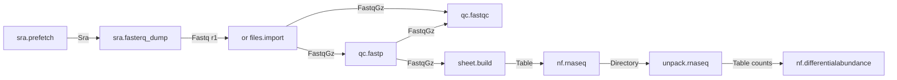

# Axial Operator Contract

The snap is the type. If two nodes will not wire, the ports are wrong — not the canvas.

**Axial is a bridge, not a boutique.** HoX ships a few tools they tastefully optimized. A solo cannot do that for STAR, GATK, Kraken, SPAdes, and the next 150 CLIs. Users bring the tools they already have. Axial makes them snap. Agents hack the dirty I/O. Jake does not hand-port the universe.

This is the ruling document for wrapping a CLI, an nf-core module, or an nf-core pipeline. Full JSON grammar: [axial-design.md](./axial-design.md). Examples: [catalog.md](./catalog.md).

Keywords MUST / MUST NOT / SHOULD as in RFC 2119.

---

## Product: the bridge

| HoX | Axial |
|---|---|
| Few native tools, curated hard | Existing CLIs + nf-core, wrapped |
| You live in their resource ontology | Default snap is **artifact type** (`FastqGz`, `Bam`, `Vcf`) |
| Tasteful optimization is the product | The **wrap generator** is the product |
| Catalog is the moat | Convention is the moat (JSON + closed types + staging). Agents fill it. |

DHH (2026-08-23): "Don't fork, just build on top. Make a tailoring script." The tailoring script is generated. Convention over configuration so a solo (or a user, or an agent) can wrap `fastp` in minutes, not tastefully rewrite it.

Untyped "connect anything" is still Galaxy. The bridge is typed **files**, not a second biology ontology you must learn before FastQC will wire.

---

## Three scales (do not mix them)

| Scale | What it is | HoX analogue | DHH analogue | Axial |
|---|---|---|---|---|
| **Brick** | One command whose I/O already matches the type list | a module over the warehouse | convention | `kind: external` / in-process |
| **Adapter** | Generated glue that *makes* a hostile tool match the type list | ingest → canonical record | tailoring script, maybe later core | `kind: adapter` (Rust or 20-line CLI we own) |
| **Compound** | A graph with published ports | an app over the same substrate | a Technique | `kind: compound` / `nf.run` |

Default canvas: **bricks the user wrapped**. FastQC → fastp → STAR is three JSON files, not a HoX-native RNA product. Detach of a 75-module pipeline is v1 and optional.

A compiled scientific DAG (`Assembly + Features + Reads → …`) is a **user/agent trick**, proven on HoX, not Axial's catalog job. We ship the generator so they can do it. We do not spend a year tastefully optimizing salmon.

**Modify the I/O, not the science.** No `star-axial`. If STAR's BAM is missing `@RG`, generate `adapt.star_bam`. The aligner stays upstream. If the adapter is good, it can become a shipped example (DHH: "maybe we just put it in core"). Core stays tiny.

### Proof: an agent compiled nf-core/rnaseq on HoX (console, 2026-08-24)

Jake's agent, not a HoX-shipped pipeline. Title: `nf-core/rnaseq 3.26.0 (HoX-native)`. Tag `hox-nfcore.adapter: bulk-rna-v1`. Git `1f03b53ef799e298f60c8`. Five nodes:

```
[Reference Assembly] → assembly ─┐
[Gene Features]      → features ─┼→ [Pseudoalignment] → [Feature Counts]
[Reads]              → reads    ─┘
```

HoX provided kinds. The agent compiled. That is the proof that **format + agent** beats **Jake curates 8 tools**.

Steal the *move*, not the boutique. On Axial the default format is artifact types, so wrapping `fastqc` does not require inventing `Reads`. Kinds are an optional overlay when someone (agent, user) compiles a pipeline into a scientific DAG. Axial does not owe `adapt.bulk_rna` as a product. Ship `axial ops wrap` so anyone can make that graph.

Physical files in CAS. Default snap is **artifact type**. Kind is opt-in.

---

## The snap rule

An edge is legal iff `compatible(src, dst)`:

- Equal artifact types: yes.
- `Union` on an **input** only: yes if any member matches.
- `FastqGz → Fastq`: **no**. Do not silent-gunzip. FastQC takes `Union[Fastq, FastqGz]`.
- `Directory` is **not** a wildcard. Only `nf.run` / pipeline compounds may emit `Directory`.
- No `Any`. No untyped `File`.
- Paired-end is two ports (`r1`, `r2`), not a list. Scatter is v1.

Closed **artifact** types (bytes on disk — grow only with a wedge need):

```
Sra, Fastq, FastqGz, Fasta, FastaGz, Gtf, GtfGz,
Bam, Bai, Vcf, VcfGz, Table, Json, Html, Image, Directory, Text,
Preview
```

`Gtf` is a real file, not a boutique kind.

Value types: `String, Int, Float, Bool, Accession, Json`.

**`compatible()` defaults to artifact type.** That is how existing tools snap. `FastqGz` wires to FastQC, fastp, STAR, Kraken without a `Reads` ontology.

**Kind is optional.** A compiled graph MAY tag ports `Assembly` / `Features` / `Reads` / `Pseudoalignment` / `Counts` (or others a user invents in their project). Kind-to-kind edges extra-check. Missing kind = artifact-only. Axial does not maintain a biology ontology. Users who want HoX-style DAGs add kinds in the wrap, or an agent does.

New artifact type = design change (CAS, staging, sniff). New kind = a string in a JSON file. Cheap on purpose.

---

## MUST (every operator)

1. **Typed ports.** Every file the tool reads or writes is a named port with a type from the closed list. Params are scalars, not files (unless the file is a path the user types and `files.import` already ingested).
2. **JSON schema, deny unknown fields.** `operators/<id>.json`. Overlay: project > `~/.config/axial/operators/` > shipped.
3. **argv is execve tokens.** No `/bin/sh -c`. Tokens MAY mix `{param.x}`, `{input.x}`, `{work}/out`. `{flag.x}` omits the whole token when false.
4. **Outputs are globs** after spawn, then ingested to CAS. One match, or `optional: true`. Two+ = `GlobMulti`. `exclude` is allowed (see `fasterq-dump` unpaired).
5. **Do not write `$HOME`.** Out dir is `{work}/out`. SRA: always `-O`. FastQC: `-o` directory MUST exist (supervisor `mkdir -p`).
6. **Exit 0 means success** unless `success_exit_codes` says otherwise.
7. **One command.** One binary, or one `nextflow run`. Pipes are two bricks (nf-core module granularity). Exception: a documented multi-tool brick (`bwa mem \| samtools sort`) with a name that says so.
8. **`cost: high` or `low`.** High never viewer-pulls. Genomics CLIs are high. Preview extractors are low.
9. **Do not fork the scientific tool.** Own an **adapter** if I/O is dirty. If argv cannot express the tool, the adapter *is* the modification. Axial does not import Python. Agents generate adapters; humans review the type contract.
10. **Deterministic enough to hash.** Same inputs + params + schema → same cook key. Do not embed timestamps in output names if you can help it; glob the stable suffix. Adapters MUST be in the cook key (schema hash).

---

## MUST NOT

- Untyped `File` / `path` ports.
- Kitchen-sink "this node runs any command."
- Shadow a shipped `(id, version)` with a different tool.
- Put sequence bytes in `Preview`. Preview is a cheap PNG/TSV-head/log.
- Emit `Directory` from a brick. Unpack a pipeline directory with a **typed unpacker brick**, or leave it as the pipeline's published `Directory`.
- Require the user to hand-write a samplesheet when the inputs are already wired FastQs. That is our job (`sheet.build`). The sheet is a `Table`, not a ritual.

---

## How to wrap a CLI (~5 minutes)

Copy `operators/qc.fastqc.json`. Change `id`, `bin`, ports, argv, globs. Drop it in `$PROJECT/operators/` or send a PR.

Checklist:

| Question | If no |
|---|---|
| Can I pass input files as argv? | Add `-i` / positional. Cwd-only tools get a glue script. |
| Can I set the output directory? | `-o {work}/out` or `--outdir`. If the tool writes next to the input, glob `{work}/in/...` is forbidden (inputs are read-only). Glue script copies. |
| Are output names glob-able? | `*_fastqc.html`, not random UUIDs. |
| Does it sniff extensions? | Good. Axial stages `{work}/in/<port>/<basename>` so it sees `SRR.fastq.gz`, not a hex blob. |
| Does it refuse overwrite? | Fine. Each cook is a fresh attempt dir. |
| Does it need a samplesheet? | See Sheet, below. Do not make the user invent CSV. |

You do **not** rewrite FastQC, STAR, or Kraken. You declare ports. If the binary will not honor them, generate an adapter.

### `axial ops wrap` (the solo scaling path)

This is the product. Not a tasteful STAR port.

```text
axial ops wrap --bin fastp --in FastqGz --out FastqGz
axial ops wrap --from-nf-module path/to/meta.yml
```

Or on the canvas: drop a binary / paste `--help`. Agent (v0.2) returns `operator.json` + glue if needed. User accepts. Cook. If it snaps, ship it in `$PROJECT/operators/`.

MUST: emit closed artifact types, argv tokens, globs, a one-file fixture test. SHOULD: guess types from extensions in `--help`. MUST NOT: invent a new artifact type without failing loud. Kind tags are optional in the wrap.

Jake does not run this for every tool. Users and agents do. Axial ships the convention and a handful of examples so the generator has something to copy.

---

## How to wrap an nf-core module

nf-core modules already have `meta.yml` (channel structure, `pattern`, optional EDAM). That is their contract. Ours is stricter on *types*.

Map:

| nf-core `meta.yml` | Axial |
|---|---|
| `type: file` + `pattern: "*.fastq.gz"` | artifact `FastqGz` |
| `*.bam` / `*.cram` | `Bam` (CRAM is not in v0.1 — add `Cram` when a wedge needs it, do not silent-alias) |
| `*.vcf.gz` | `VcfGz` |
| `*.{fa,fasta}` | `Fasta` |
| `type: map` (`meta`, `meta2`) | **Drop.** Provenance is the cache, not a Groovy map. `meta.id` → node name / param. `meta.single_end` → whether `r2` is bound. |
| `type: boolean` / `val` | Param |
| `versions.yml` | Ignore, or optional `Text` |
| `optional: true` | `"optional": true` |
| container / conda | v0.1: `bin` on PATH. Container seam is later (same ExternalProcess, different supervisor). |

Prefer calling the **tool binary** (`fastqc`, `star`, `kraken2`) over `nextflow run` of a one-module pipeline. Nextflow is for compounds (whole pipelines) and for modules that only exist as Groovy+container.

A later `axial ops import-nf-module` MAY generate the JSON from `meta.yml`. Until then, hand-write. The mapping above is the generator spec.

---

## How to wrap an nf-core pipeline

Three legal paths, user's choice. Axial does not pick a tasteful cut for them.

1. **Compound (blunt):** `nextflow run nf-core/<name> -r <pin> --input {input.sheet} --outdir {work}/out`. Out is `Directory`. Ugly. Works today. Exception to the no-Directory rule.
2. **Bricks (Lego):** wrap the modules you actually want (`fastp`, `star`, `salmon`) as JSON. Build the graph yourself. This is the default we optimize for.
3. **Compile (agent):** same move as `bulk-rna-v1` on HoX. Agent emits a small graph with optional kinds. Axial does not maintain that graph as a product.

Pin `-r`. `nextflow_schema.json` → params. Do not wrap `nf-core/fetchngs`; use SRA bricks.

---

## How to run a Snakemake workflow

The checked-in `smk.workflow` operator is the workflow-engine analogue of a
blunt `nextflow run`, with one important staging rule:

1. Import the project directory through `files.import_directory`.
2. Wire its `Directory` output to `smk.workflow.workflow`.
3. Axial copies that directory into the cook attempt before running
   `snakemake --directory <copy> --cores <n>`.
4. Axial ingests the completed copy as `run: Directory`.

Directory inputs MUST be staged as copies, not CAS symlinks, because Snakemake
normally writes results and `.snakemake` metadata beside the workflow. The
source directory and CAS object MUST remain immutable. `use_conda`, `dry_run`,
`keep_going`, and `printshellcmds` map to Snakemake CLI flags; no shell wrapper
or second execution engine is involved.

A catalog workflow is not automatically a typed Axial operator. Its repository
must first be reviewed for configuration, target, input, output, revision, and
license expectations. Once those are explicit, wrap it as a more specific
`smk.<name>` operator or compile its useful tools into Axial bricks.

---

## Sheet (the anti-Lego, solved)

Almost every nf-core pipeline takes a CSV samplesheet. That is a form, not a snap.

**Sheet** = a `Table` artifact whose columns match a named schema.

| Pipeline | Columns (canonical) |
|---|---|
| `nf-core/rnaseq` | `sample,fastq_1,fastq_2,strandedness` |
| `nf-core/sarek` | `patient,sample,lane,fastq_1,fastq_2` (+ tumor/normal as documented) |
| `nf-core/ampliseq` | per current pipeline docs (sample, fastq_1, fastq_2, …) |

Brick `sheet.build`:

- Inputs: `r1: FastqGz`, optional `r2`, params for the extra columns (`sample`, `strandedness`, …).
- Output: `sheet: Table`.
- v0.1: **one sample**. N samples is scatter (v1 IR decision). Until then, N rows is a hand-imported CSV via `files.import` typed `Table`.

The pipeline node then takes `sheet`, not raw FASTQs. FASTQ → sheet.build → nf.rnaseq is three snaps. That is the magic.

---

## What Axial will change vs what you change

| Who | What |
|---|---|
| **You / agent** | `operator.json`. Adapter source if the CLI is hostile. Generated, reviewed, in-repo. |
| **Axial** | Staging (real basenames), CAS, cook key (includes adapter schema), typecheck, supervisor. |
| **Nobody** | A long-lived fork of STAR/GATK/Kraken. |

Convention over configuration (DHH, 20 years, now training data for agents): one adapter template. Agent fills argv, globs, types. Human sees a small file, not a jungle.

If a tool cannot comply even with an adapter (GUI-only, no CLI, nondeterministic blobs as the only output), it is not an Axial operator.

## Adapter (the hack, not the boutique)

An adapter is glue **the user or an agent writes** so a hostile binary never has to know Axial exists. Axial may ship examples. Axial does not tastefully rewrite the field.

MUST:

- Live in `$PROJECT/adapters/<id>/` (or shipped `adapters/` if it is an example) with `operator.json` + glue (`main.rs` preferred, or a 20-line script as `bin`).
- Speak closed **artifact** types on ports. Kind tags optional. Inside, call the upstream binary.
- Deterministic. No clock in output names.
- In the cook key (schema + glue bytes). Upstream binary not hashed (Decision 21).
- Transform on the way in/out: samplesheet, `@RG`, FASTQ pair, BAM→BAI, FastQC PNG, unpack a `Directory`.
- Never reimplement STAR. Never "Axial-STAR."

SHOULD be generated from `--help` + one fixture. Cap ~80 lines. Over that: the artifact type is wrong, or you actually need a new one.

The stud is `FastqGz` / `Bam` / `Vcf`. The adapter is the sleeve. HoX put sleeves in a warehouse and shipped eight of them. We put sleeves in the cook and let anyone generate the next one.

---

## Submitting to the catalog

1. `operators/<id>.json` in a PR. `id` is `family.name` (`qc.fastqc`, `align.star`, `nf.rnaseq`).
2. Lint: schema, closed types, argv interpolator, glob, no unknown fields.
3. Curated bricks and compounds get a CI fixture (tiny FASTQ, fake bin, or `AXIAL_LIVE_SRA=1`). JSON-only drops from users do not run on our CI.
4. We will reject: untyped ports, `Directory` from a brick, shell wrappers, kitchen-sink nodes, a second FastQC with a different `id` that is the same tool.

This is **not** a Galaxy tool shed and **not** an nf-core modules mirror. The catalog is curated. The JSON drop path exists so you can wrap *your* lab tool today without a vote.

---

## Lego, in one picture



Every arrow is a type. No arrow is a prayer. `nf.differentialabundance` does not take a BAM; it takes a counts `Table`. If you want BAM, you unpack it, or you snap `align.star` as a brick and never enter the pipeline compound.
